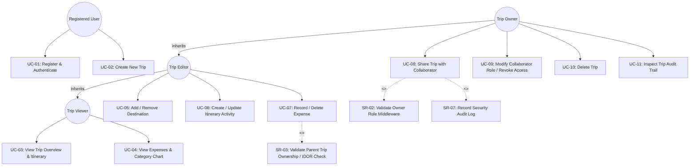
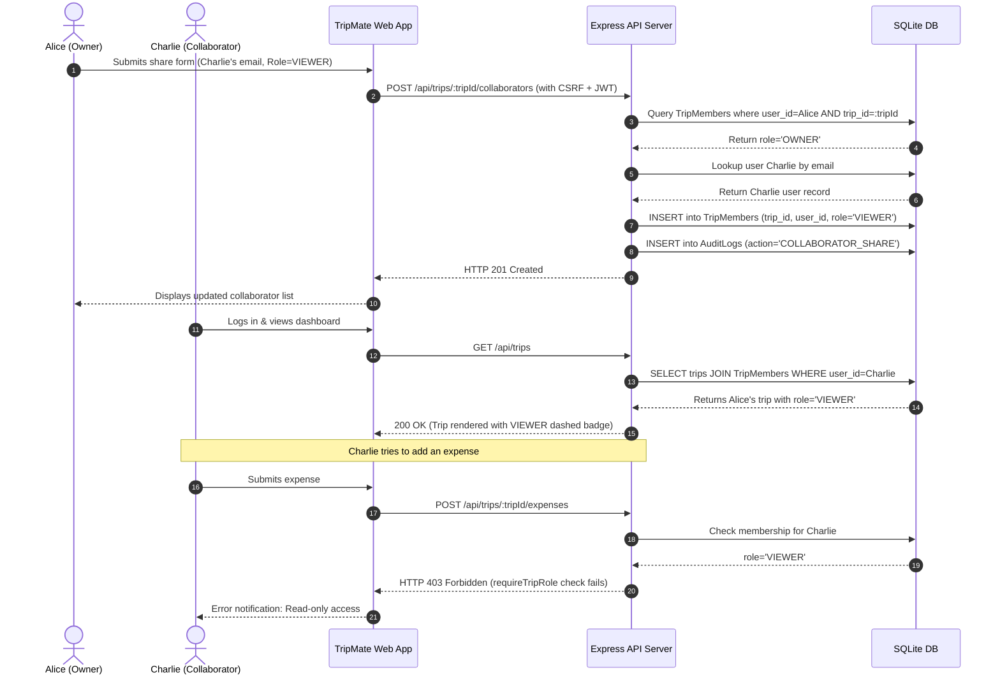

# 03. Use Case Specifications & Collaboration Analysis

## 1. Mermaid Use Case Diagram

---

## 2. Detailed Use Case Specifications

### Use Case UC-08: Share Trip with Permission
- **Primary Actor:** Trip OWNER
- **Preconditions:** The actor is authenticated; a trip exists where the actor has role `OWNER`.
- **Trigger:** Owner enters collaborator email, selects role (`OWNER`, `EDITOR`, or `VIEWER`), and submits the share modal.
- **Main Success Scenario:**
  1. The actor sends `POST /api/trips/:tripId/collaborators` with email and role.
  2. The server verifies the CSRF token and validates the actor's session JWT.
  3. The `requireTripRole(['OWNER'])` middleware verifies the actor is an owner of `:tripId`.
  4. The server queries `Users` table by email to find the recipient account.
  5. The server confirms the recipient is not already a collaborator on this trip.
  6. The server inserts a record into `TripMembers` with the specified role.
  7. The server calls `logAudit()` to record the `COLLABORATOR_SHARE` event with timestamp and IP.
  8. The server returns HTTP 201 Created with collaborator details.
- **Alternative / Exceptional Flows:**
  - *Recipient not registered:* Server returns 404 with error message: "User with this email not found."
  - *Recipient already added:* Server returns 409 Conflict.
  - *Caller is EDITOR or VIEWER:* Server returns 403 Forbidden.
  - *Caller has no access to trip:* Server returns 404 Not Found (BOLA prevention).

### Use Case UC-07: Edit Shared Expense
- **Primary Actor:** Trip OWNER or EDITOR
- **Preconditions:** Actor is authenticated; trip exists; actor has role `OWNER` or `EDITOR`.
- **Main Success Scenario:**
  1. Actor submits new expense (amount, currency, category, description, paid_by, date).
  2. Server verifies CSRF token.
  3. `requireTripRole(['OWNER', 'EDITOR'])` validates permissions.
  4. Validation schema checks that `amount > 0` and category is valid enum.
  5. Database executes parameterized `INSERT INTO Expenses`.
  6. Server records `EXPENSE_CREATE` in `AuditLogs`.
  7. Server returns HTTP 201 Created.
- **Alternative Flows:**
  - *Caller has VIEWER role:* Server rejects request with HTTP 403 Forbidden.
  - *Amount is negative or zero:* Server validation returns HTTP 400 Bad Request.

---

## 3. Scenario-Based Analysis Model: "Share Trip and Collaborate"

