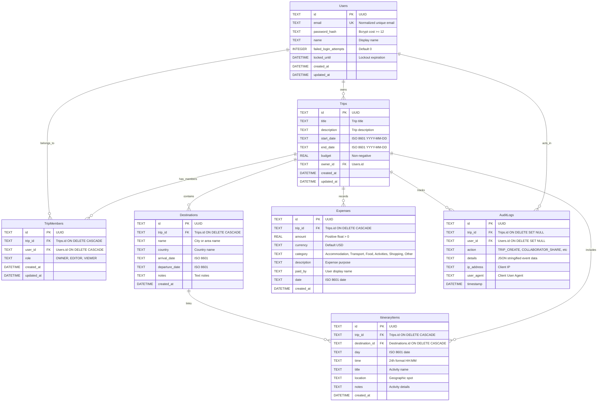
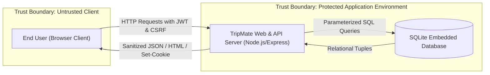
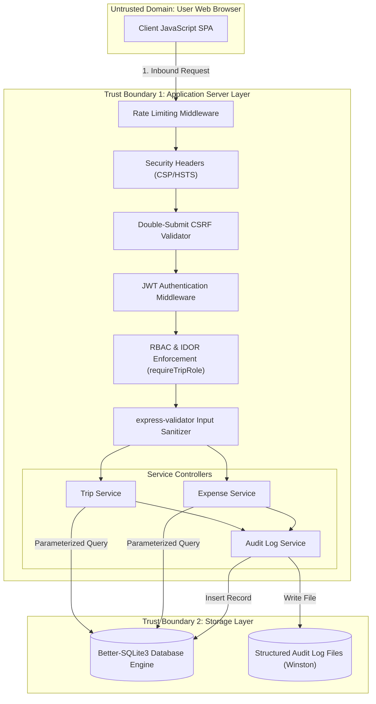

# 04. Data Models & Data Flow Diagrams (DFD)

## 1. Entity-Relationship (ER) Diagram

```mermaid
erDiagram
  Users ||--o{ Trips : "owns"
  Users ||--o{ TripMembers : "belongs_to"
  Trips ||--o{ TripMembers : "has_members"
  Trips ||--o{ Destinations : "contains"
  Destinations ||--o{ ItineraryItems : "links"
  Trips ||--o{ ItineraryItems : "includes"
  Trips ||--o{ Expenses : "records"
  Trips ||--o{ AuditLogs : "tracks"
  Users ||--o{ AuditLogs : "acts_in"

  Users {
    TEXT id PK "UUID"
    TEXT email UK "Normalized unique email"
    TEXT password_hash "Bcrypt cost >= 12"
    TEXT name "Display name"
    INTEGER failed_login_attempts "Default 0"
    DATETIME locked_until "Lockout expiration"
    DATETIME created_at
    DATETIME updated_at
  }

  Trips {
    TEXT id PK "UUID"
    TEXT title "Trip title"
    TEXT description "Trip description"
    TEXT start_date "ISO 8601 YYYY-MM-DD"
    TEXT end_date "ISO 8601 YYYY-MM-DD"
    REAL budget "Non-negative"
    TEXT owner_id FK "Users.id"
    DATETIME created_at
    DATETIME updated_at
  }

  TripMembers {
    TEXT id PK "UUID"
    TEXT trip_id FK "Trips.id ON DELETE CASCADE"
    TEXT user_id FK "Users.id ON DELETE CASCADE"
    TEXT role "OWNER, EDITOR, VIEWER"
    DATETIME created_at
    DATETIME updated_at
  }

  Destinations {
    TEXT id PK "UUID"
    TEXT trip_id FK "Trips.id ON DELETE CASCADE"
    TEXT name "City or area name"
    TEXT country "Country name"
    TEXT arrival_date "ISO 8601"
    TEXT departure_date "ISO 8601"
    TEXT notes "Text notes"
    DATETIME created_at
  }

  ItineraryItems {
    TEXT id PK "UUID"
    TEXT trip_id FK "Trips.id ON DELETE CASCADE"
    TEXT destination_id FK "Destinations.id ON DELETE CASCADE"
    TEXT day "ISO 8601 date"
    TEXT time "24h format HH:MM"
    TEXT title "Activity name"
    TEXT location "Geographic spot"
    TEXT notes "Activity details"
    DATETIME created_at
  }

  Expenses {
    TEXT id PK "UUID"
    TEXT trip_id FK "Trips.id ON DELETE CASCADE"
    REAL amount "Positive float > 0"
    TEXT currency "Default USD"
    TEXT category "Accommodation, Transport, Food, Activities, Shopping, Other"
    TEXT description "Expense purpose"
    TEXT paid_by "User display name"
    TEXT date "ISO 8601 date"
    DATETIME created_at
  }

  AuditLogs {
    TEXT id PK "UUID"
    TEXT trip_id FK "Trips.id ON DELETE SET NULL"
    TEXT user_id FK "Users.id ON DELETE SET NULL"
    TEXT action "TRIP_CREATE, COLLABORATOR_SHARE, etc"
    TEXT details "JSON stringified event data"
    TEXT ip_address "Client IP"
    TEXT user_agent "Client User Agent"
    DATETIME timestamp
  }
```

---

## 2. Level-0 Context DFD (Data Flow Diagram)

```mermaid
flowchart LR
  subgraph TrustBoundary1 ["Trust Boundary: Untrusted Client"]
    User["End User (Browser Client)"]
  end

  subgraph TrustBoundary2 ["Trust Boundary: Protected Application Environment"]
    System["TripMate Web & API Server (Node.js/Express)"]
    DataStore[("SQLite Embedded Database")]
  end

  User -->|HTTP Requests with JWT & CSRF| System
  System -->|Sanitized JSON / HTML / Set-Cookie| User
  System -->|Parameterized SQL Queries| DataStore
  DataStore -->|Relational Tuples| System
```

---

## 3. Level-1 Detailed DFD with Trust Boundaries

```mermaid
flowchart TD
  subgraph BrowserZone ["Untrusted Domain: User Web Browser"]
    Browser["Client JavaScript SPA"]
  end

  subgraph AppBoundary ["Trust Boundary 1: Application Server Layer"]
    RateLimiter["Rate Limiting Middleware"]
    Helmet["Security Headers (CSP/HSTS)"]
    CSRF["Double-Submit CSRF Validator"]
    Auth["JWT Authentication Middleware"]
    RBAC["RBAC & IDOR Enforcement (requireTripRole)"]
    Validator["express-validator Input Sanitizer"]
    
    subgraph Controllers ["Service Controllers"]
      TripService["Trip Service"]
      ExpenseService["Expense Service"]
      AuditService["Audit Log Service"]
    end
  end

  subgraph DataBoundary ["Trust Boundary 2: Storage Layer"]
    SQLite[("Better-SQLite3 Database Engine")]
    LogFiles[("Structured Audit Log Files (Winston)")]
  end

  Browser -->|1. Inbound Request| RateLimiter
  RateLimiter --> Helmet
  Helmet --> CSRF
  CSRF --> Auth
  Auth --> RBAC
  RBAC --> Validator
  Validator --> TripService
  Validator --> ExpenseService
  
  TripService -->|Parameterized Query| SQLite
  ExpenseService -->|Parameterized Query| SQLite
  TripService --> AuditService
  ExpenseService --> AuditService
  AuditService -->|Insert Record| SQLite
  AuditService -->|Write File| LogFiles
```
