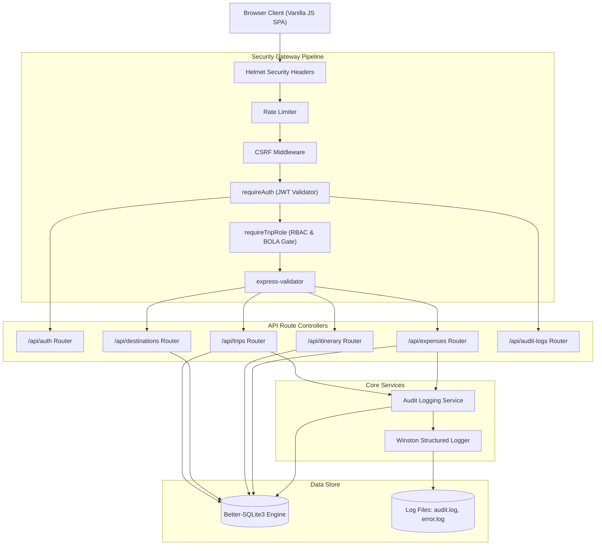

# 05. Software Architecture & Security Component Mapping

## 1. Layered Architecture Justification
TripMate follows a clean, 4-tier layered architecture designed for separation of concerns and defense-in-depth:
1. **Presentation Layer (`public/`):** Vanilla HTML5/CSS3/JavaScript SPA running in client sandbox. Communicates over HTTPS via JSON REST APIs.
2. **Security Gateway Layer (`src/middleware/`):** Centralized interceptors that enforce security controls before any business logic executes (`helmet`, `cors`, `rateLimit`, `csrf`, `auth`, `rbac`, `validate`).
3. **Application & Routing Layer (`src/routes/` & `src/services/`):** Implements use-case orchestration, business rule validation, and audit recording.
4. **Data Access Layer (`src/db/`):** Parameterized prepared statements executed through Better-SQLite3 with WAL mode and foreign key constraints enabled.

---

## 2. Component Diagram

---

## 3. Design Patterns Implemented

| Pattern | Component | Architectural Purpose |
|---|---|---|
| **1. Middleware / Chain of Responsibility** | `src/middleware/auth.js`, `rbac.js`, `validate.js` | Decouples cross-cutting security concerns (authentication, role checking, input validation) from core business logic. |
| **2. Singleton** | `src/db/index.js` (`getDb()`) | Manages a single open connection pool to the SQLite database with WAL mode and foreign keys enabled. |
| **3. Strategy Pattern** | `requireTripRole(['OWNER', 'EDITOR'])` | Dynamically selects the authorization evaluation strategy based on the route's role requirements. |
| **4. Facade Pattern** | `src/services/auditService.js` | Provides a unified interface (`logAudit`) to record events simultaneously into the SQLite `AuditLogs` table and the Winston structured file stream. |
| **5. Repository Pattern** | Route handlers querying `better-sqlite3` | Isolates SQL statement preparation from HTTP request and response structures. |

---

## 4. Security Control Mapping Matrix

| Security Requirement | Component / File | Implementation Mechanism |
|---|---|---|
| **Authentication (SR-01)** | `src/middleware/auth.js` | Extracts JWT from HttpOnly cookie, verifies signature against `JWT_SECRET`, checks account lockout status. |
| **Authorization / RBAC (SR-02)** | `src/middleware/rbac.js` | Queries `TripMembers` joining `Trips`, verifies role against allowed list, blocks unauthorized access. |
| **IDOR / BOLA Prevention (SR-03)** | `src/middleware/rbac.js` | Returns HTTP 404 for non-existent or inaccessible trips; verifies child resource foreign keys match parent `tripId`. |
| **CSRF Defense (SR-05)** | `src/middleware/csrf.js` | Generates double-submit random token cookie (`XSRF-TOKEN`) and verifies matching `x-csrf-token` header on state mutations. |
| **Audit Traceability (SR-07)** | `src/services/auditService.js` | Records user ID, trip ID, action, JSON details, and client IP into database and Winston log files. |
