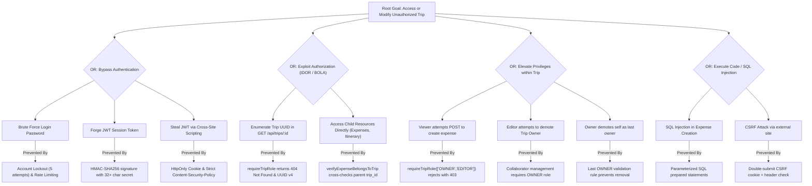

# 08. Attack Tree & Security-Refined Architecture

## 1. Attack Tree Diagram

Root Goal: **"Access or modify a trip I am not authorized for"**

---

## 2. Preventive and Detective Controls

| Control Category | Control ID | Mechanism | Attack Vector Addressed |
|---|---|---|---|
| **Preventive** | **PC-01** | HttpOnly, SameSite=Strict session cookie | Cookie theft via XSS |
| **Preventive** | **PC-02** | Reusable `requireTripRole` middleware | IDOR / Unauthorized modifications |
| **Preventive** | **PC-03** | Express-validator schemas & type validation | Malformed payloads, SQLi, XSS |
| **Preventive** | **PC-04** | Prepared statements with bound parameters | SQL injection (CWE-89) |
| **Preventive** | **PC-05** | Double-submit CSRF verification | Cross-Site Request Forgery (CWE-352) |
| **Detective** | **DC-01** | Structured JSON security logging (`auditService`) | Identification of abnormal access patterns |
| **Detective** | **DC-02** | Automated negative integration tests (`security.test.js`)| Verification of defensive controls |
| **Detective** | **DC-03** | Fuzzing harness (`tests/fuzz/fuzz.js`) | Detection of unhandled parser exceptions |
