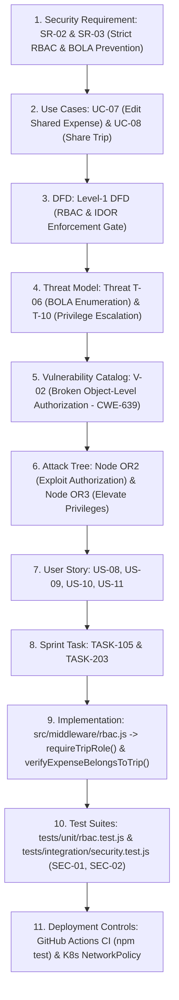

# 16. Final Security Review & Traceability Chain

## 1. Complete Traceability Chain
**Security Requirement (SR-02 / SR-03):** *"Only authorized collaborators with the right role can access or modify a trip, child resources, or permissions."*

---

## 2. Top 3 Residual Risks & Controls

| Risk Rank | Residual Risk Description | Inherent Risk | Implemented Controls & Residual Risk Level |
|---|---|---|---|
| **Risk 1** | **Database Storage File Compromise on Host:** If an attacker gains full root shell on the underlying host, the unencrypted SQLite file could be read directly. | High | **Low (Residual):** Container runs as unprivileged `appuser` (UID 10001), `allowPrivilegeEscalation: false`, read-only root system, capabilities dropped, K8s secrets isolation. |
| **Risk 2** | **Compromised User Credentials via Phishing:** Legitimate credentials phished from a user allowing authorized session establishment. | High | **Medium (Residual):** Account lockout on 5 failed attempts, 15-minute short JWT expiry, full audit logging of IP/User-Agent, and role segregation limiting damage. |
| **Risk 3** | **DoS via Complex Network Flooding:** Volumetric network layer DDoS exceeding ingress capacity. | Medium | **Low (Residual):** Two-tier application rate limiting (global + auth), 50kb request payload cap, and upstream reverse proxy / cloud WAF mitigation. |

---

## 3. Project Limitations
1. **Single-Node SQLite Concurrency:** SQLite in WAL mode handles concurrent reads efficiently, but write locks serialize simultaneous high-frequency transactions across hundreds of parallel requests. (Suitable for offline lab exam; for hyperscale, migrate database adapter to PostgreSQL).
2. **Ephemeral Disk on Free Hosting:** On Render free web service tier without persistent disk attachments, the SQLite database resets when the container goes to sleep or restarts. (Mitigated by automated database seeder and Docker mount volume in Kubernetes).
