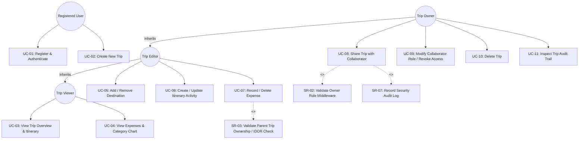
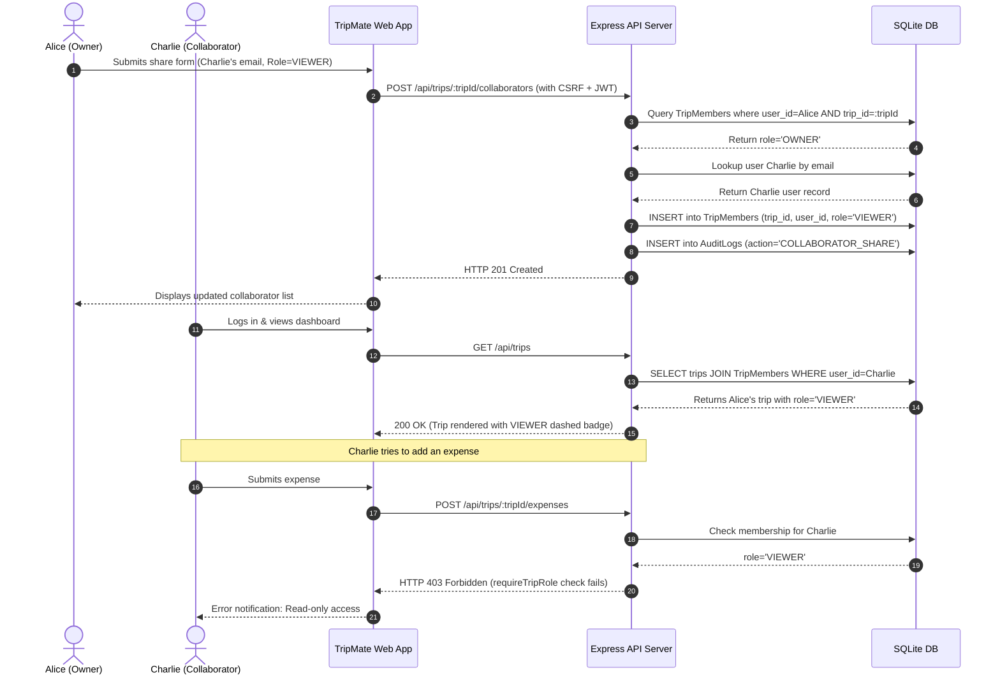
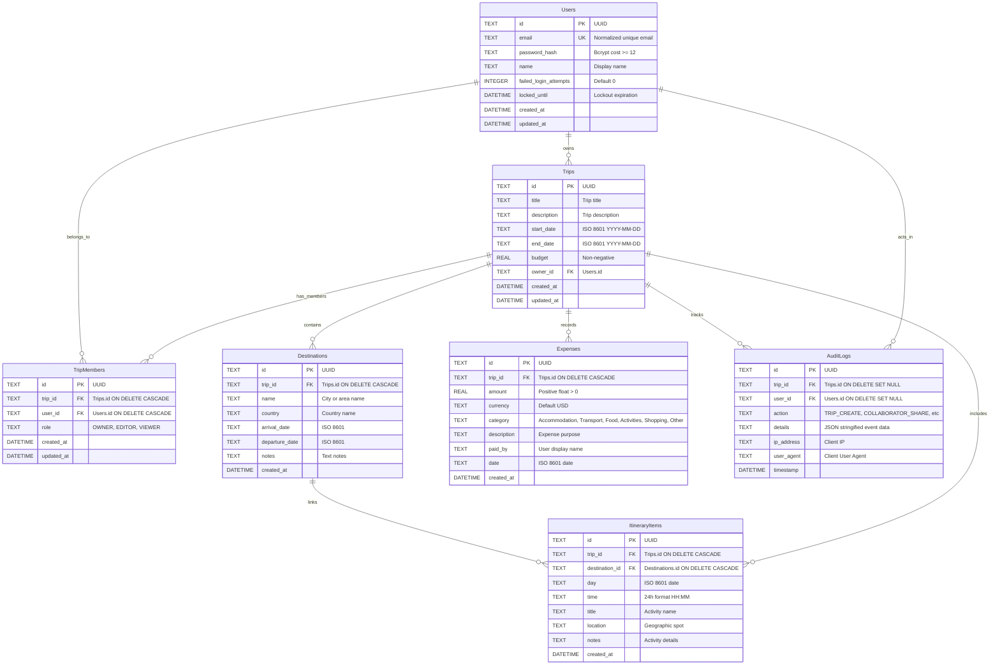
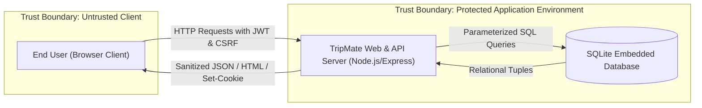
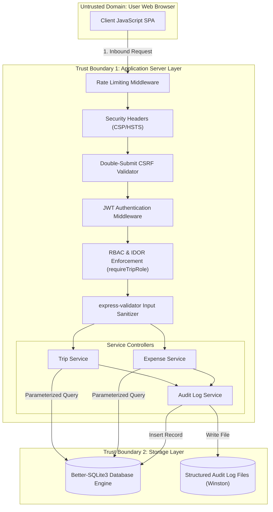
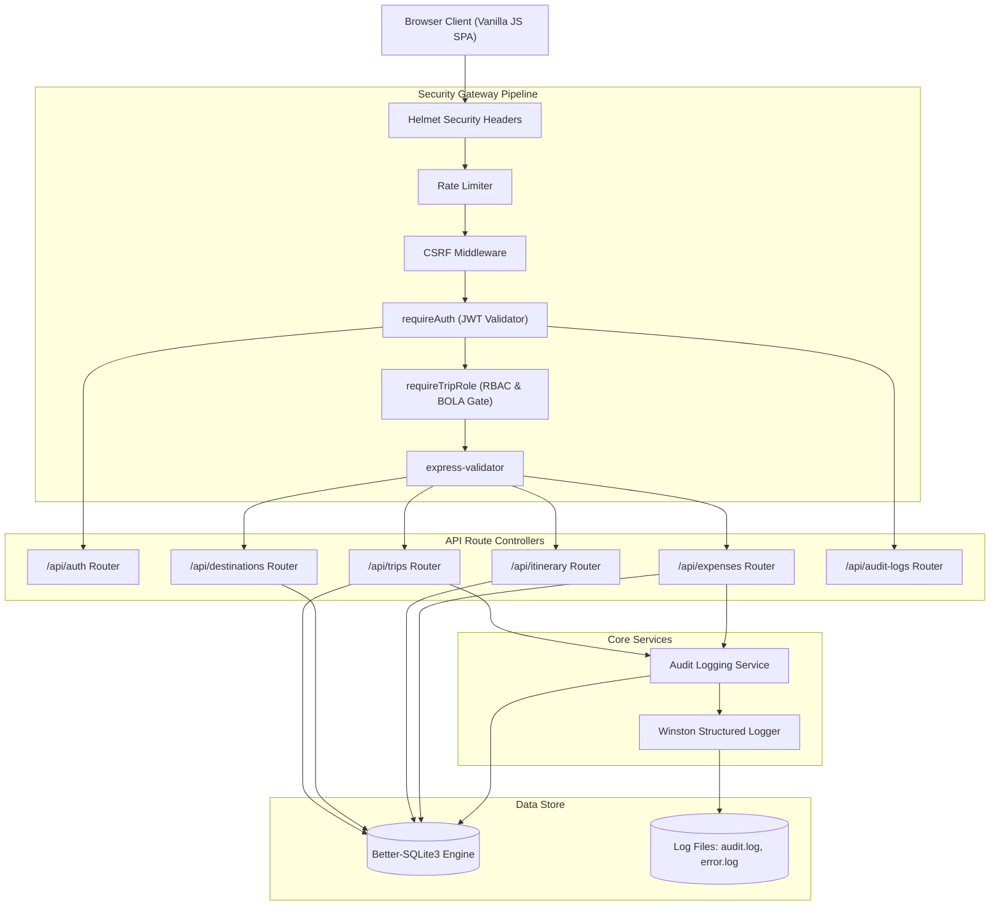
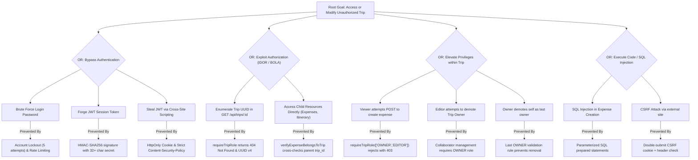
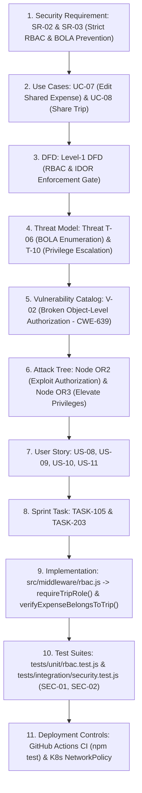

# TRIPMATE: COMPREHENSIVE SECURE SOFTWARE ENGINEERING REPORT
**Course:** 24CYS401 Secure Software Engineering Lab Exam  
**System Name:** TripMate — Collaborative Travel-Planning Web Application  
**Date of Compilation:** 2026-10-08T05:23:06.012Z  

---

## TABLE OF CONTENTS

1. [PROJECT OVERVIEW & README](#project-overview--readme)
2. [01. AGILE & XP METHODOLOGY](#01-agile--xp-methodology)
3. [02. SOFTWARE REQUIREMENTS SPECIFICATION (SRS)](#02-software-requirements-specification-srs)
4. [03. USE CASES & COLLABORATION SCENARIO](#03-use-cases--collaboration-scenario)
5. [04. DATA MODELS & DATA FLOW DIAGRAMS (DFD)](#04-data-models--data-flow-diagrams-dfd)
6. [05. SOFTWARE ARCHITECTURE & PATTERNS](#05-software-architecture--patterns)
7. [06. USER INTERFACE SPECIFICATION & WIREFRAMES](#06-user-interface-specification--wireframes)
8. [07. THREAT MODEL (STRIDE METHODOLOGY)](#07-threat-model-stride-methodology)
9. [08. ATTACK TREE & DEFENSIVE ARCHITECTURE](#08-attack-tree--defensive-architecture)
10. [09. PRODUCT BACKLOG & SPRINT PLANNING](#09-product-backlog--sprint-planning)
11. [10. SPRINT METRICS & JIRA IMPORT DATA](#10-sprint-metrics--jira-import-data)
12. [11. SECURE BUILD & PIPELINE CONTROLS](#11-secure-build--pipeline-controls)
13. [12. SECURE CODING REFACTORING (BEFORE & AFTER)](#12-secure-coding-refactoring-before--after)
14. [13. AUTOMATED SECURITY FUZZING REPORT](#13-automated-security-fuzzing-report)
15. [14. SOFTWARE DEFECT REPORT (DEF-01)](#14-software-defect-report-def01)
16. [15. LOGGING, HARDENING & OPERATIONAL CONTROLS](#15-logging-hardening--operational-controls)
17. [16. FINAL SECURITY REVIEW & TRACEABILITY CHAIN](#16-final-security-review--traceability-chain)
18. [17. GITHUB & RENDER DEPLOYMENT LAB MANUAL](#17-github--render-deployment-lab-manual)
19. [18. VULNERABILITY DISCLOSURE POLICY](#18-vulnerability-disclosure-policy)

---


<div style="page-break-before: always;"></div>

# SECTION 1: PROJECT OVERVIEW & README

*Source File Reference:* `README.md`

# TripMate — Collaborative Travel Planning Web Application
[](https://github.com/monis/tripmate/actions/workflows/ci.yml)
[](https://github.com/monis/tripmate/actions/workflows/codeql.yml)
[](https://github.com/monis/tripmate/pkgs/container/tripmate)
[](https://tripmate.onrender.com)
[](https://monis.github.io/tripmate/)

> **Course:** 24CYS401 Secure Software Engineering Lab Exam  
> **Aesthetic:** Strict Black & White Minimalist Design (No colored accents)

---

## 1. Quick Overview & Security Highlights
TripMate is a secure, collaborative travel-planning platform designed for privacy, defense-in-depth, and traceability:
- **Authentication:** Salted bcrypt password hashing (cost 12), short-lived JWT (15 min) in an HttpOnly, SameSite=Strict, Secure cookie.
- **Account Lockout:** Locks user out after 5 consecutive failed login attempts for 15 minutes.
- **Access Control & IDOR/BOLA Protection:** Server-side `requireTripRole` middleware; inaccessible or non-existent trips return **HTTP 404** (not 403) to prevent resource enumeration.
- **Privilege Escalation Defense:** Collaborators cannot elevate their own role; the last OWNER of a trip cannot be removed or demoted.
- **Injection Defense:** 100% Parameterized SQL queries using `better-sqlite3` prepared statements.
- **State Mutation Defense:** Double-submit CSRF cookie (`XSRF-TOKEN`) verified against headers on all mutating verbs.
- **Fuzzing & Hardening:** Verified against 33 malicious payloads (buffer overflows, null bytes, type confusion, malformed JSON).

---

## 2. Demo Credentials
The repository includes an automated seeder creating 3 demo users and a shared trip:
- **Password (for all demo accounts):** `StrongPassword123!`
- **Demo Accounts:**
  1. **OWNER:** `owner@tripmate.local` (Full administration, share/revoke, delete, trip audit logs)
  2. **EDITOR:** `editor@tripmate.local` (Can add/edit destinations, itinerary, expenses)
  3. **VIEWER:** `viewer@tripmate.local` (Read-only access)

---

## 3. How to Run Locally

### Prerequisites
- Node.js 20+ installed
- Git installed

### Steps
```bash
# 1. Install dependencies
npm install

# 2. Seed demo database
npm run seed

# 3. Start local development server
npm start
```
Open [http://localhost:3000](http://localhost:3000) in your web browser.

---

## 4. How to Run Tests & Security Fuzzing

```bash
# Run all tests (Unit, Integration, E2E, Negative Security)
npm test

# Run unit tests only
npm run test:unit

# Run integration tests (Collaboration lifecycle & role progression)
npm run test:integration

# Run negative security tests (IDOR, SQLi, XSS, CSRF, Token forgery)
npm run test:security

# Run end-to-end tests
npm run test:e2e

# Run security fuzzing harness (generates tests/fuzz/FUZZ_REPORT.md)
npm run fuzz
```

---

## 5. Deployment Options

### A. Run with Docker
```bash
# Pull image from GitHub Container Registry
docker pull ghcr.io/<your-username>/tripmate:latest

# Or build locally:
docker build -t tripmate .

# Run container as non-root user:
docker run -p 3000:3000 --env-file .env tripmate
```

### B. Deploy on Kubernetes (Minikube)
```bash
# 1. Start Minikube
minikube start

# 2. Apply Kubernetes manifests
kubectl apply -f k8s/namespace.yaml
kubectl apply -f k8s/secret.example.yaml
kubectl apply -f k8s/deployment.yaml
kubectl apply -f k8s/service.yaml
kubectl apply -f k8s/networkpolicy.yaml

# 3. Access the service
minikube service tripmate-service -n tripmate
```

### C. Live Cloud Deployment (Render.com)
- TripMate includes a `render.yaml` Blueprint.
- Simply connect your GitHub repository to Render as a Web Service.
- Set `JWT_SECRET` and `NODE_ENV=production`.
- Live health check available at `/health`.

---

## 6. Exam Screenshot Checklist (Capture for Lab Evidence)

| # | Item to Capture | How to Display |
|---|---|---|
| **1** | **Passing Test Suite** | Terminal showing `npm test` passing with 26/26 tests across 5 suites. |
| **2** | **Fuzzing Harness Execution** | Terminal running `npm run fuzz` and `tests/fuzz/FUZZ_REPORT.md` (33/33 handled, 0 crashes). |
| **3** | **Black & White UI Dashboard** | Browser at `/` showing Trip cards with OWNER, EDITOR, VIEWER badges. |
| **4** | **B/W SVG Expense Bar Chart** | Trip Detail > Expenses tab showing pure SVG category spending bars. |
| **5** | **Share Modal & Role Management** | Owner opening Collaborators modal with role dropdowns and revoke actions. |
| **6** | **Defect Report & Retest** | `docs/defect-report.md` documenting DEF-01 SQLite `'now'` syntax fix. |
| **7** | **GitHub Actions Green CI** | GitHub Actions tab showing green check on `ci.yml` pipeline. |
| **8** | **Branch Protection Rules** | GitHub Repo `Settings > Branches` showing protected `main` branch. |
| **9** | **GitHub Pages Documentation** | Browser viewing the published `docs/index.html` portal. |
| **10**| **Docker / Minikube Pods** | Terminal output of `kubectl get pods -n tripmate`. |


---


<div style="page-break-before: always;"></div>

# SECTION 2: 01. AGILE & XP METHODOLOGY

*Source File Reference:* `docs/01-agile.md`

# 01. Agile & Scrum Process with Extreme Programming (XP) Practices

## 1. Methodology Justification: Scrum + XP Hybrid
TripMate is engineered utilizing a Scrum framework enriched with Extreme Programming (XP) engineering practices. While Scrum provides predictable cadences (two-week sprints, Daily Scrums, Sprint Reviews, and Retrospectives), XP integrates rigorous software engineering controls essential for a high-integrity Secure Software Engineering course (24CYS401):
- **Test-Driven Development (TDD):** Writing automated unit/integration tests before or alongside code ensures boundary constraints and security assertion rules are preserved.
- **Continuous Integration (CI):** Immediate automated linting, security scanning, and test execution on every commit.
- **Refactoring:** Continuous code improvement to eliminate technical and security debt.
- **Pair Programming / Mandatory Peer Review:** Ensuring that all security-critical authorization logic is peer-reviewed and signed off.

---

## 2. Mapping Agile Manifesto Principles to TripMate

| Agile Principle | TripMate Security Implementation |
|---|---|
| **1. Early and continuous delivery of valuable software** | Deliver runnable increments of TripMate each sprint with core RBAC security gates verified by automated pipelines. |
| **2. Welcome changing requirements, even late in development** | Modular middleware architecture (`requireTripRole`, `csrfProtection`) allows permission rules and security policies to evolve without breaking existing API routes. |
| **3. Working software is the primary measure of progress** | Every sprint deliverable must pass automated security negative tests, regression tests, and fuzzing checks before deployment. |
| **4. Technical excellence and good design enhance agility** | Clean architecture, layered separation of concerns, and parameterized queries eliminate regressions and prevent security bottlenecks. |
| **5. Build projects around motivated individuals and provide environment/support** | Blameless post-mortems and traceable security audit trails empower developers to identify and remediate security vulnerabilities promptly. |

---

## 3. Refactoring Examples with Before / After

### Refactoring Example 1: Eliminating SQL Injection & Centralizing Authorization (RF-01)
- **Before:** Direct SQL string interpolation inside endpoint handler without authorization checks:
  ```javascript
  // Before: Vulnerable and coupled
  const sql = "INSERT INTO Expenses (id, amount) VALUES ('" + id + "', " + amount + ")";
  db.exec(sql);
  ```
- **After:** Parameterized prepared statement wrapped in reusable RBAC middleware:
  ```javascript
  // After: Secure, parameterized, and decoupled
  router.post('/expenses', requireTripRole(['OWNER', 'EDITOR']), expenseValidation, (req, res) => {
    db.prepare('INSERT INTO Expenses (id, amount) VALUES (?, ?)').run(id, amount);
  });
  ```
- **Benefit:** Eliminated SQL injection risk (CWE-89) and centralized role-based authorization logic.

### Refactoring Example 2: Hardened Authentication Error Handling (RF-02)
- **Before:** Detailed database error returned directly to client in HTTP 500 response:
  ```javascript
  // Before: Information Disclosure (CWE-209)
  res.status(500).json({ error: err.message, query: sql });
  ```
- **After:** Centralized error-handling middleware:
  ```javascript
  // After: Generic client response, sanitized internal logging
  logger.error('Database query execution error', { error: err.message });
  res.status(500).json({ success: false, error: 'An internal server error occurred.' });
  ```

---

## 4. Agile Risks & Mitigations

| Risk ID | Agile Risk Description | Impact | Mitigation Strategy |
|---|---|---|---|
| **R-01** | **Security Debt Accumulation:** Velocity pressure leading to deferred authorization checks or incomplete input validation. | High | Definition of Done (DoD) requires 100% pass on negative security tests, zero high/critical `npm audit` findings, and parameterized SQL verification. |
| **R-02** | **Scope Creep in Collaboration Roles:** Frequent changes to permission matrices causing inconsistent IDOR checks. | Medium | Use a single centralized middleware (`requireTripRole`) and maintain a single source of truth for permission tables in code and documentation. |


---


<div style="page-break-before: always;"></div>

# SECTION 3: 02. SOFTWARE REQUIREMENTS SPECIFICATION (SRS)

*Source File Reference:* `docs/02-srs.md`

# 02. Software Requirements Specification (SRS)

## 1. Stakeholders and Actors
- **OWNER:** Trip creator or promoted collaborator possessing full administrative authority over the trip (can share, revoke, modify permissions, delete trip, and inspect trip audit logs).
- **EDITOR:** Collaborator permitted to create, update, and delete trip sub-resources (destinations, itinerary items, expenses); cannot share or delete the trip.
- **VIEWER:** Collaborator with read-only permissions across trip details, destinations, itinerary timeline, and expenses.
- **ADMINISTRATOR:** Platform operations engineer responsible for container deployment, cluster hardening, and log monitoring.
- **ANONYMOUS VISITOR:** Unauthenticated end-user restricted to registration and login screens.

---

## 2. Requirements Table (Prioritized: FR, NFR, SR)

| Requirement ID | Type | Description | Priority |
|---|---|---|---|
| **FR-01** | Functional | User registration with name, email, and strong password | Must Have |
| **FR-02** | Functional | User login issuing short-lived JWT stored in HttpOnly cookie | Must Have |
| **FR-03** | Functional | Create, update, view, and delete trips with title, dates, budget | Must Have |
| **FR-04** | Functional | Manage destinations (name, country, arrival/departure dates, notes) | Must Have |
| **FR-05** | Functional | Manage itinerary timeline items linked to destinations | Must Have |
| **FR-06** | Functional | Record expenses with amount, category, currency, and date | Must Have |
| **FR-07** | Functional | Share trip with collaborators by email assigning OWNER, EDITOR, VIEWER | Must Have |
| **FR-08** | Functional | Owner can modify collaborator roles or revoke trip access | Must Have |
| **FR-09** | Functional | Visual black/white expense category breakdown chart | Should Have |
| **NFR-01** | Non-Functional | Response time under 200ms for all API queries | Must Have |
| **NFR-02** | Non-Functional | Strict Black & White minimal responsive design (WCAG AA compliant) | Must Have |
| **NFR-03** | Non-Functional | Offline runnable without cloud database dependencies (SQLite embedded) | Must Have |
| **SR-01** | Security | Password complexity (min 10 chars, uppercase, lowercase, digit, symbol, bcrypt >= 12) | Must Have |
| **SR-02** | Security | Reusable server-side RBAC middleware (`requireTripRole`) | Must Have |
| **SR-03** | Security | IDOR/BOLA prevention returning HTTP 404 for unauthorized trips | Must Have |
| **SR-04** | Security | Account lockout after 5 consecutive failed login attempts (15 min) | Must Have |
| **SR-05** | Security | Double-Submit CSRF protection on all state-modifying requests | Must Have |
| **SR-06** | Security | Parameterized SQL queries preventing SQL injection (CWE-89) | Must Have |
| **SR-07** | Security | Immutable security audit logging for authentication and authorization events | Must Have |
| **SR-08** | Security | Last OWNER protection (cannot remove or demote the last trip owner) | Must Have |

---

## 3. CIA Triad & Core Security Requirements

### Confidentiality (C)
- User data isolation: Users can only view trips they own or that have been explicitly shared with them.
- Protection of credentials: Passwords hashed with bcrypt cost 12. Password hashes and tokens are strictly excluded from audit logs and API responses.
- Prevention of existence disclosure: Attempts by unauthorized users to probe trip endpoints return HTTP 404 rather than 403.

### Integrity (I)
- Server-side role enforcement: Write operations (create/update/delete) are restricted to `OWNER` and `EDITOR` roles.
- Prevention of privilege escalation: Collaborators cannot elevate their own permissions, and the last `OWNER` of a trip cannot be removed.
- CSRF validation ensures that state-changing requests originate from authenticated user intent.

### Availability (A)
- Tiered rate-limiting: Global rate limit of 100 requests / 15 min; authentication rate limit of 10 requests / 15 min.
- Account lockout mitigates brute-force credential stuffing.
- Payload size restrictions (`50kb`) defend against memory exhaustion and denial-of-service vectors.


---


<div style="page-break-before: always;"></div>

# SECTION 4: 03. USE CASES & COLLABORATION SCENARIO

*Source File Reference:* `docs/03-usecases.md`

# 03. Use Case Specifications & Collaboration Analysis

## 1. Mermaid Use Case Diagram



---

## 2. Detailed Use Case Specifications

### Use Case UC-08: Share Trip with Permission
- **Primary Actor:** Trip OWNER
- **Preconditions:** The actor is authenticated; a trip exists where the actor has role `OWNER`.
- **Trigger:** Owner enters collaborator email, selects role (`OWNER`, `EDITOR`, or `VIEWER`), and submits the share modal.
- **Main Success Scenario:**
  1. The actor sends `POST /api/trips/:tripId/collaborators` with email and role.
  2. The server verifies the CSRF token and validates the actor's session JWT.
  3. The `requireTripRole(['OWNER'])` middleware verifies the actor is an owner of `:tripId`.
  4. The server queries `Users` table by email to find the recipient account.
  5. The server confirms the recipient is not already a collaborator on this trip.
  6. The server inserts a record into `TripMembers` with the specified role.
  7. The server calls `logAudit()` to record the `COLLABORATOR_SHARE` event with timestamp and IP.
  8. The server returns HTTP 201 Created with collaborator details.
- **Alternative / Exceptional Flows:**
  - *Recipient not registered:* Server returns 404 with error message: "User with this email not found."
  - *Recipient already added:* Server returns 409 Conflict.
  - *Caller is EDITOR or VIEWER:* Server returns 403 Forbidden.
  - *Caller has no access to trip:* Server returns 404 Not Found (BOLA prevention).

### Use Case UC-07: Edit Shared Expense
- **Primary Actor:** Trip OWNER or EDITOR
- **Preconditions:** Actor is authenticated; trip exists; actor has role `OWNER` or `EDITOR`.
- **Main Success Scenario:**
  1. Actor submits new expense (amount, currency, category, description, paid_by, date).
  2. Server verifies CSRF token.
  3. `requireTripRole(['OWNER', 'EDITOR'])` validates permissions.
  4. Validation schema checks that `amount > 0` and category is valid enum.
  5. Database executes parameterized `INSERT INTO Expenses`.
  6. Server records `EXPENSE_CREATE` in `AuditLogs`.
  7. Server returns HTTP 201 Created.
- **Alternative Flows:**
  - *Caller has VIEWER role:* Server rejects request with HTTP 403 Forbidden.
  - *Amount is negative or zero:* Server validation returns HTTP 400 Bad Request.

---

## 3. Scenario-Based Analysis Model: "Share Trip and Collaborate"




---


<div style="page-break-before: always;"></div>

# SECTION 5: 04. DATA MODELS & DATA FLOW DIAGRAMS (DFD)

*Source File Reference:* `docs/04-data-models.md`

# 04. Data Models & Data Flow Diagrams (DFD)

## 1. Entity-Relationship (ER) Diagram



---

## 2. Level-0 Context DFD (Data Flow Diagram)



---

## 3. Level-1 Detailed DFD with Trust Boundaries




---


<div style="page-break-before: always;"></div>

# SECTION 6: 05. SOFTWARE ARCHITECTURE & PATTERNS

*Source File Reference:* `docs/05-architecture.md`

# 05. Software Architecture & Security Component Mapping

## 1. Layered Architecture Justification
TripMate follows a clean, 4-tier layered architecture designed for separation of concerns and defense-in-depth:
1. **Presentation Layer (`public/`):** Vanilla HTML5/CSS3/JavaScript SPA running in client sandbox. Communicates over HTTPS via JSON REST APIs.
2. **Security Gateway Layer (`src/middleware/`):** Centralized interceptors that enforce security controls before any business logic executes (`helmet`, `cors`, `rateLimit`, `csrf`, `auth`, `rbac`, `validate`).
3. **Application & Routing Layer (`src/routes/` & `src/services/`):** Implements use-case orchestration, business rule validation, and audit recording.
4. **Data Access Layer (`src/db/`):** Parameterized prepared statements executed through Better-SQLite3 with WAL mode and foreign key constraints enabled.

---

## 2. Component Diagram



---

## 3. Design Patterns Implemented

| Pattern | Component | Architectural Purpose |
|---|---|---|
| **1. Middleware / Chain of Responsibility** | `src/middleware/auth.js`, `rbac.js`, `validate.js` | Decouples cross-cutting security concerns (authentication, role checking, input validation) from core business logic. |
| **2. Singleton** | `src/db/index.js` (`getDb()`) | Manages a single open connection pool to the SQLite database with WAL mode and foreign keys enabled. |
| **3. Strategy Pattern** | `requireTripRole(['OWNER', 'EDITOR'])` | Dynamically selects the authorization evaluation strategy based on the route's role requirements. |
| **4. Facade Pattern** | `src/services/auditService.js` | Provides a unified interface (`logAudit`) to record events simultaneously into the SQLite `AuditLogs` table and the Winston structured file stream. |
| **5. Repository Pattern** | Route handlers querying `better-sqlite3` | Isolates SQL statement preparation from HTTP request and response structures. |

---

## 4. Security Control Mapping Matrix

| Security Requirement | Component / File | Implementation Mechanism |
|---|---|---|
| **Authentication (SR-01)** | `src/middleware/auth.js` | Extracts JWT from HttpOnly cookie, verifies signature against `JWT_SECRET`, checks account lockout status. |
| **Authorization / RBAC (SR-02)** | `src/middleware/rbac.js` | Queries `TripMembers` joining `Trips`, verifies role against allowed list, blocks unauthorized access. |
| **IDOR / BOLA Prevention (SR-03)** | `src/middleware/rbac.js` | Returns HTTP 404 for non-existent or inaccessible trips; verifies child resource foreign keys match parent `tripId`. |
| **CSRF Defense (SR-05)** | `src/middleware/csrf.js` | Generates double-submit random token cookie (`XSRF-TOKEN`) and verifies matching `x-csrf-token` header on state mutations. |
| **Audit Traceability (SR-07)** | `src/services/auditService.js` | Records user ID, trip ID, action, JSON details, and client IP into database and Winston log files. |


---


<div style="page-break-before: always;"></div>

# SECTION 7: 06. USER INTERFACE SPECIFICATION & WIREFRAMES

*Source File Reference:* `docs/06-ui.md`

# 06. User Interface Specification & Wireframes (Strict Black & White Minimalist)

## 1. Design System & Aesthetic Principles
TripMate follows a strict **black and white minimalism** design aesthetic:
- **Palette:** Pure Black (`#000000`, `#0A0A0A`), Pure White (`#FFFFFF`), and Neutral Slate Greys (`#141414`, `#1F1F1F`, `#2A2A2A`, `#888888`, `#CCCCCC`). Zero accent colors are used.
- **Visual Status Cues:** Communicated using role pill badges:
  - **OWNER:** Solid filled pill (solid white background, black text in dark mode).
  - **EDITOR:** Solid outlined pill (1px solid border).
  - **VIEWER:** Dashed outlined pill (1px dashed border).
- **Typography:** Modern clean sans-serif system stack (`Inter`), with monospaced numbers (`ui-monospace`, `Courier New`) for currency values and UUIDs.
- **Contrast & Accessibility:** WCAG AA compliant contrast ratios across dark and light modes.

---

## 2. Screen Specifications & Wireframe Layouts

### Screen 1: Login & Registration Portal
```text
+-------------------------------------------------------------+
|                      [ TripMate SECURE ]                     |
|              Secure Travel Planning Portal (24CYS401)       |
|                                                             |
|   +-----------------------------------------------------+   |
|   | Email Address:                                      |   |
|   | [ user@tripmate.local                             ] |   |
|   |                                                     |   |
|   | Password:                                           |   |
|   | [ •••••••••••••••••                               ] |   |
|   |                                                     |   |
|   | [ [ SIGN IN ] (Solid White Pill)                  ] |   |
|   |                                                     |   |
|   | Need an account? Register                           |   |
|   +-----------------------------------------------------+   |
|   Demo: owner@tripmate.local | Password: StrongPassword123! |
+-------------------------------------------------------------+
```
- **Inputs:** Email, Password (min 10 chars, complexity).
- **Feedback:** Inline validation error, lockout warning on 5 failed attempts, toast notification.
- **Security:** CSRF double-submit token attached; generic error messages (`Invalid email or password`).

---

### Screen 2: Dashboard (Trips Grid & Stats)
```text
+------------------------------------------------------------------------------------+
| TripMate  [SECURE]    |  Trips Dashboard                   [ + New Trip (Pill) ]  |
+-----------------------+------------------------------------------------------------+
| [Dashboard]           |  [ STATS CARDS ]                                           |
| [My Trips]            |  | Accessible Trips: 3 | Owned: 1 | Expenses: $1,350.50 |   |
| [Audit Log]           |  +--------------------------------------------------------+
|                       |                                                            |
|                       |  YOUR ACTIVE TRIPS                                         |
|                       |  +------------------------+  +--------------------------+  |
|                       |  | Tokyo Exploration 2026 |  | Alpine Expedition 2026   |  |
|                       |  | [OWNER (Solid)]        |  | [VIEWER (Dashed)]        |  |
|                       |  | Akihabara & Shibuya    |  | Skiing in Swiss Alps     |  |
|                       |  | 2026-11-01 to 11-10    |  | 2026-12-01 to 12-10      |  |
|                       |  | Budget: $3,500.00      |  | Budget: $5,000.00        |  |
|                       |  +------------------------+  +--------------------------+  |
| [Toggle Theme B/W]    |                                                            |
| Alice (Owner) [Logout]|                                                            |
+-----------------------+------------------------------------------------------------+
```
- **Role Awareness:** Trip cards show distinct role badges; cards only display trips the user has access to.

---

### Screen 3: Trip Detail View with Tabs
Tabs: **Overview | Destinations | Itinerary | Expenses & Chart | Collaborators | Audit Log (Owner)**
```text
+------------------------------------------------------------------------------------+
| Top Bar: Tokyo Tech & Culture Exploration 2026     [Collaborators] [Delete Trip]   |
+------------------------------------------------------------------------------------+
| [Overview]  [Destinations]  [Itinerary]  [Expenses & Chart]  [Trip Activity Log]   |
+------------------------------------------------------------------------------------+
| SPENDING BY CATEGORY (Pure SVG / CSS B/W Horizontal Bar Chart)                     |
| Accommodation  [=========================         ] $850.00 (63%)                   |
| Transport      [=========                         ] $320.00 (24%)                   |
| Food           [====                              ] $115.50 (9%)                    |
| Activities     [==                                ] $65.00  (4%)                    |
|                                                                                    |
| EXPENSES TABLE                                          [ + Add Expense (Pill) ]   |
| Date        Category       Description            Paid By     Amount      Action   |
| 2026-11-01  Accommodation  Century Southern Tower Alice       $850.00     [Delete] |
| 2026-11-01  Transport      Japan Rail Pass        Bob         $320.00     [Delete] |
+------------------------------------------------------------------------------------+
```
- **Role Enforcement:** `[+ Add Expense]`, `[+ Add Destination]`, and `[Delete]` buttons are hidden if the user's role is `VIEWER`.

---

### Screen 4: Share Trip Modal (Collaborators & Permissions)
```text
+-------------------------------------------------------------+
| Trip Collaborators & Permissions                        [X] |
+-------------------------------------------------------------+
| Invite Collaborator:                                        |
| [ bob@tripmate.local         ] [ Role: EDITOR v ] [ Invite] |
|                                                             |
| Active Members:                                             |
| Alice (Owner)      alice@tripmate.local    [ OWNER v   ]    |
| Bob (Editor)       bob@tripmate.local      [ EDITOR v  ] [X]|
| Charlie (Viewer)   charlie@tripmate.local  [ VIEWER v  ] [X]|
+-------------------------------------------------------------+
```
- **Security Controls:** Only accessible to `OWNER`. Server prevents removing or demoting the last `OWNER`.


---


<div style="page-break-before: always;"></div>

# SECTION 8: 07. THREAT MODEL (STRIDE METHODOLOGY)

*Source File Reference:* `docs/07-threat-model.md`

# 07. Threat Model (STRIDE Methodology)

## 1. Asset Inventory & CIA Classification

| Asset ID | Asset Name | Description | CIA Impact |
|---|---|---|---|
| **A-01** | User Password Hashes | Salted bcrypt hashes in `Users` table | **C: Critical, I: High, A: Low** |
| **A-02** | JWT Signing Secret | Secret key used to sign session cookies | **C: Critical, I: Critical, A: High** |
| **A-03** | Trip Financial Records | Budget, individual expenses, currencies | **C: High, I: Critical, A: Medium** |
| **A-04** | User Itineraries & Dates | Physical locations, hotels, timestamps | **C: High, I: High, A: Medium** |
| **A-05** | Collaborator Permission Matrix | `TripMembers` role bindings | **C: Medium, I: Critical, A: High** |
| **A-06** | Security Audit Trail | Immutable event logs in `AuditLogs` | **C: High, I: Critical, A: High** |
| **A-07** | CSRF Tokens | Cryptographic double-submit tokens | **C: High, I: High, A: Low** |
| **A-08** | Database Storage File | `tripmate.db` SQLite database on disk | **C: Critical, I: Critical, A: Critical** |

---

## 2. STRIDE Threat Analysis Table (10+ Threats)

| Threat ID | STRIDE Category | Affected Element | Threat Description | Potential Impact | Implemented Mitigation |
|---|---|---|---|---|---|
| **T-01** | **Spoofing** | Auth Controller | Attacker submits forged or expired JWT token | Impersonation of legitimate user | `jwt.verify` with short expiry (15m), signature validation, and secret key length check |
| **T-02** | **Spoofing** | API Endpoints | Cross-Site Request Forgery (CSRF) from malicious website | Unintended trip/expense modification | Double-submit CSRF cookie token with `SameSite=Strict` and `x-csrf-token` header check |
| **T-03** | **Tampering** | Expense Route | Parameter tampering: negative amounts or altered trip IDs | Financial calculation disruption | `express-validator` schema checking `amount > 0` and UUID format |
| **T-04** | **Tampering** | Database Layer | SQL Injection via raw string concatenation in queries | Arbitrary database corruption or exfiltration | Parameterized queries with prepared statements via `better-sqlite3` |
| **T-05** | **Repudiation** | Collaborator Route | User revokes member or modifies role and denies doing so | Lack of accountability | Audit logging in `AuditLogs` and Winston with IP, user ID, and timestamp |
| **T-06** | **Information Disclosure** | Trip Route | IDOR / BOLA: User enumerates private trip IDs | Leakage of private travel schedules | Server-side `requireTripRole` middleware returning HTTP 404 instead of 403 |
| **T-07** | **Information Disclosure** | Error Handler | Unhandled exception reveals database schema or stack trace | Information disclosure (CWE-209) | Centralized error handler returning generic user messages and logging internally |
| **T-08** | **Denial of Service** | Login Route | Credential brute-forcing via automated bot dictionary attacks | Server resource exhaustion, account takeover | Rate limiting (10 req/15 min) and account lockout after 5 consecutive failures |
| **T-09** | **Denial of Service** | JSON Body Parser | Giant payload submission causing buffer overflow or OOM | Application denial of service | Body parser limit set to strict `50kb` |
| **T-10** | **Elevation of Privilege** | Member Role Route | VIEWER or EDITOR modifies role or revokes trip owner | Unauthorized administrative takeover | Server-side role check requiring `OWNER` role, plus rule preventing last OWNER removal |
| **T-11** | **Tampering / XSS** | Presentation Layer | Attacker injects `<script>` tags into trip titles or notes | Stored Cross-Site Scripting (XSS) | `express-validator` HTML entity escaping and strict CSP via Helmet |

---

## 3. Information-Flow Analysis for Sensitive Assets

```mermaid
flowchart TD
  subgraph Asset1 ["Asset 1: User Password"]
    P1["Client Input (Plaintext)"] -->|HTTPS / TLS| P2["Express Validation"]
    P2 -->|bcrypt.hash (Cost >= 12)| P3["Users.password_hash (DB)"]
    P3 -.->|NEVER exposed in API / logs| P4["[Redacted / Excluded]"]
  end

  subgraph Asset2 ["Asset 2: JWT Session Token"]
    J1["Generated on Successful Login"] -->|Sign with JWT_SECRET| J2["Set-Cookie Header"]
    J2 -->|HttpOnly + SameSite=Strict| J3["Browser Cookie Jar"]
    J3 -->|Auto-attached on safe requests| J4["requireAuth Middleware"]
  end

  subgraph Asset3 ["Asset 3: Financial & Trip Data"]
    D1["Client Expense Payload"] -->|CSRF + JWT| D2["requireTripRole Verification"]
    D2 -->|Parameterized Prepared Statement| D3["Expenses Table (DB)"]
    D3 -->|Filtered by User Membership| D4["Authorized Client Only"]
  end
```

---

## 4. Vulnerability Catalog & Mitigations

| Vuln ID | Vulnerability Name | Related Threat | Impact | Technical Mitigation |
|---|---|---|---|---|
| **V-01** | SQL Injection (CWE-89) | T-04 | Critical | Parameterized queries with prepared statements via `better-sqlite3` |
| **V-02** | Broken Object-Level Authorization (CWE-639) | T-06 | High | `requireTripRole` middleware returning 404 for inaccessible resources |
| **V-03** | Cross-Site Request Forgery (CWE-352) | T-02 | High | Double-Submit CSRF cookie validation on all mutating verbs |
| **V-04** | Stored Cross-Site Scripting (CWE-79) | T-11 | Medium | `express-validator` `.escape()` and Helmet Content Security Policy |
| **V-05** | Credential Stuffing / Brute-Force (CWE-307) | T-08 | High | Account lockout after 5 failed attempts + auth rate limiter |
| **V-06** | Information Leakage in Errors (CWE-209) | T-07 | Medium | Centralized error handler suppressing stack traces in responses |


---


<div style="page-break-before: always;"></div>

# SECTION 9: 08. ATTACK TREE & DEFENSIVE ARCHITECTURE

*Source File Reference:* `docs/08-attack-tree.md`

# 08. Attack Tree & Security-Refined Architecture

## 1. Attack Tree Diagram

Root Goal: **"Access or modify a trip I am not authorized for"**



---

## 2. Preventive and Detective Controls

| Control Category | Control ID | Mechanism | Attack Vector Addressed |
|---|---|---|---|
| **Preventive** | **PC-01** | HttpOnly, SameSite=Strict session cookie | Cookie theft via XSS |
| **Preventive** | **PC-02** | Reusable `requireTripRole` middleware | IDOR / Unauthorized modifications |
| **Preventive** | **PC-03** | Express-validator schemas & type validation | Malformed payloads, SQLi, XSS |
| **Preventive** | **PC-04** | Prepared statements with bound parameters | SQL injection (CWE-89) |
| **Preventive** | **PC-05** | Double-submit CSRF verification | Cross-Site Request Forgery (CWE-352) |
| **Detective** | **DC-01** | Structured JSON security logging (`auditService`) | Identification of abnormal access patterns |
| **Detective** | **DC-02** | Automated negative integration tests (`security.test.js`)| Verification of defensive controls |
| **Detective** | **DC-03** | Fuzzing harness (`tests/fuzz/fuzz.js`) | Detection of unhandled parser exceptions |


---


<div style="page-break-before: always;"></div>

# SECTION 10: 09. PRODUCT BACKLOG & SPRINT PLANNING

*Source File Reference:* `docs/09-backlog.md`

# 09. Product Backlog & Sprint Planning

## 1. Epics Overview
- **EPIC-1: Identity, Authentication & Session Security (AUTH)**
- **EPIC-2: Trip Lifecycle & Multi-Resource Planning (CORE)**
- **EPIC-3: Granular Role-Based Access Control & Collaboration (RBAC)**
- **EPIC-4: Security Auditing, Hardening & Compliance (SEC)**

---

## 2. Product Backlog (12+ User Stories)

| Story ID | Epic | User Story | Priority | Story Points | Acceptance Criteria |
|---|---|---|---|---|---|
| **US-01** | EPIC-1 | As a new traveler, I want to register an account with a strong password, so that my trip plans are protected. | Must Have | 3 | Password >= 10 chars, complexity regex, bcrypt cost >= 12, email normalization. |
| **US-02** | EPIC-1 | As a user, I want to authenticate and receive an HttpOnly JWT cookie, so that my session is protected from XSS theft. | Must Have | 5 | Token valid for 15 min, HttpOnly, SameSite=Strict, secure flag in production. |
| **US-03** | EPIC-1 | As a security admin, I want accounts locked after 5 failed logins, so that brute-force credential stuffing is blocked. | Must Have | 3 | Returns 403 on lockout, unlocks after 15 min. |
| **US-04** | EPIC-2 | As an owner, I want to create and manage trips with budgets, so that I can organize travel itineraries. | Must Have | 5 | Start date <= end date, budget >= 0, automatic OWNER assignment. |
| **US-05** | EPIC-2 | As an editor, I want to add destinations to a trip, so that we know our travel stops. | Must Have | 3 | UUID validation, arrival <= departure dates, sanitized text. |
| **US-06** | EPIC-2 | As an editor, I want to create itinerary activities linked to destinations, so that we have an organized timeline. | Must Have | 5 | Day ISO 8601, time 24h format, destination verified to belong to trip. |
| **US-07** | EPIC-2 | As an editor, I want to record expenses with categories, so that our team can track spending against budget. | Must Have | 5 | Amount > 0, valid category enum, parameterized SQL. |
| **US-08** | EPIC-3 | As an owner, I want to invite collaborators via email with OWNER, EDITOR, or VIEWER roles. | Must Have | 5 | Validates target user exists, prevents duplicate membership, writes audit log. |
| **US-09** | EPIC-3 | As an owner, I want to modify collaborator roles or revoke access, so that permissions stay up to date. | Must Have | 5 | Prevents removing or demoting the last OWNER of a trip. |
| **US-10** | EPIC-3 | As a viewer, I want to inspect trip details and itinerary without edit buttons, so that I don't submit unauthorized updates. | Must Have | 3 | UI disables edit buttons; server enforces 403 if direct write attempted. |
| **US-11** | EPIC-3 | As a traveler, I want unauthorized users to receive 404 when probing private trips, so our travel is private. | Must Have | 5 | `requireTripRole` returns 404 for inaccessible or non-existent trips. |
| **US-12** | EPIC-4 | As an owner, I want to review an audit log of trip actions, so that changes remain transparent and accountable. | Should Have | 3 | Chronological log of share, role change, revoke, and expense actions. |
| **US-13** | EPIC-4 | As a user, I want state-changing requests protected by CSRF tokens, so that cross-site exploits are prevented. | Must Have | 5 | Double-submit CSRF cookie matched against header on POST/PUT/DELETE. |

---

## 3. Sprint 1 Plan (Core Foundation & Security Baseline)
- **Sprint Goal:** Establish hardened authentication, secure database schema, and initial trip CRUD with RBAC.
- **Sprint Backlog Tasks:**
  - TASK-101: Configure Express with Helmet, CORS, and Winston structured logger.
  - TASK-102: Implement SQLite schema with WAL mode and foreign keys (`Users`, `Trips`, `TripMembers`).
  - TASK-103: Implement Registration & Login with bcrypt (cost >= 12) and 15-minute JWT cookie.
  - TASK-104: Implement account lockout logic for 5 consecutive failed logins.
  - TASK-105: Implement `requireTripRole` middleware and Trip CRUD routes.
  - TASK-106: Write Jest unit tests for password validator and RBAC middleware.

---

## 4. Sprint 2 Plan (Collaboration, Child Resources & Hardening)
- **Sprint Goal:** Complete collaborative planning sub-resources (destinations, itinerary, expenses), CSRF protection, and audit logging.
- **Sprint Backlog Tasks:**
  - TASK-201: Implement Double-Submit CSRF protection middleware.
  - TASK-202: Implement Destinations, Itinerary timeline, and Expenses routes.
  - TASK-203: Implement Collaborator management (Invite, Role Update, Revoke, Last Owner guard).
  - TASK-204: Build Black & White minimalist SPA frontend with dynamic SVG chart.
  - TASK-205: Implement security audit logging in database and Winston logs.
  - TASK-206: Execute negative security integration tests and automated fuzzing harness.


---


<div style="page-break-before: always;"></div>

# SECTION 11: 10. SPRINT METRICS & JIRA IMPORT DATA

*Source File Reference:* `docs/10-sprint-metrics.md`

# 10. Sprint Metrics, Burndown & Jira Export

## 1. Scrum Board Workflow
Board Columns:
`[ TO DO ]` &rarr; `[ IN PROGRESS ]` &rarr; `[ TESTING / CODE REVIEW ]` &rarr; `[ DONE ]`

- **Definition of Done (DoD):**
  1. Automated Jest unit, integration, and security tests pass with 0 failures.
  2. Input validation and parameterized query constraints verified.
  3. Security event logged via `logAudit()`.
  4. Code reviewed against OWASP Secure Coding Practices.

---

## 2. Daily Scrum Log (Sprint 2, Day 7)
- **Alice (Security Lead):** Completed Double-submit CSRF middleware; resolved SQLite datetime bug during integration testing (DEF-01); currently executing fuzzing test harness.
- **Bob (Backend Engineer):** Built expense aggregation endpoint and BOLA checks for destinations and itinerary; assisting Alice with test suite.
- **Charlie (Frontend Engineer):** Implemented Black & White theme, role badges, and pure SVG expense chart; verified accessibility contrast ratios.
- **Impediments:** Resolved SQLite `'now'` datetime syntax error that briefly failed role promotion integration test.

---

## 3. Sprint 2 Burndown Data & Visual Chart

### Burndown Data Table
| Day | Estimated Story Points Remaining | Ideal Burndown Trend | Actual Story Points Completed | Notes |
|---|---|---|---|---|
| Day 1 | 26 | 26.0 | 0 | Sprint Planning completed |
| Day 3 | 21 | 20.8 | 5 | Destinations API & RBAC tested |
| Day 5 | 15 | 15.6 | 6 | Itinerary timeline completed |
| Day 7 | 8 | 10.4 | 7 | Expenses & SVG chart completed |
| Day 9 | 2 | 5.2 | 6 | DEF-01 resolved, tests passing |
| Day 10 | 0 | 0.0 | 2 | Fuzzing & K8s manifests verified |

### ASCII Burndown Chart
```text
Points
  26 | *  (Actual)
  20 |    *
  15 |       *
  10 |          *
   5 |             *
   0 +----------------*---
     D1  D3  D5  D7  D9  D10
```

---

## 4. Sprint Review & Retrospective
- **Velocity:** 26 story points delivered in Sprint 2.
- **Defects Discovered:** 1 defect (DEF-01: SQLite datetime function syntax error) caught in integration testing and remediated immediately.
- **Carry-over:** 0 story points.
- **Retrospective Actions:**
  1. *Action 1:* Enforce automated SQL syntax verification in linting pipelines to catch quote discrepancies early.
  2. *Action 2:* Maintain automated fuzzing in GitHub Actions CI to catch edge cases prior to staging deployments.


---


<div style="page-break-before: always;"></div>

# SECTION 12: 11. SECURE BUILD & PIPELINE CONTROLS

*Source File Reference:* `docs/11-secure-build.md`

# 11. Secure Build, Branch Strategy & Repository Controls

## 1. Branch Strategy (GitFlow Variant)
- **`main` (Protected Production Branch):** Always deployable. Direct commits and force pushes are blocked.
- **`develop` (Integration Branch):** Aggregates tested features.
- **`feature/*` (Feature Branches):** Branch off `develop`, submit PRs targeting `develop` or `main`.

---

## 2. Secure Pipeline Controls (5+ Controls)
1. **Protected Branches:** Branch protection rule on `main` requiring pull request reviews, passing status checks (`build-and-test`), and linear commit history.
2. **Least Privilege CI Tokens:** Every GitHub Actions workflow declares top-level `permissions: contents: read`, elevating permissions only in specific jobs (e.g., `packages: write` for GHCR).
3. **Secret Scanning & Gitleaks:** Scans repository on every push to prevent hardcoded credentials or API keys.
4. **Automated Dependency Auditing:** `npm audit --audit-level=high` runs in CI, backed by automated weekly Dependabot PRs.
5. **Static Application Security Testing (SAST):** CodeQL automated workflow scanning for JavaScript security vulnerabilities on every push, PR, and weekly schedule.
6. **Immutable Container Signatures:** Multi-stage Docker build producing non-root container images published to GitHub Container Registry (ghcr.io) tagged with both `:latest` and the specific commit SHA.

---

## 3. Secret Management & Gitleaks Proof
No secrets are committed to the codebase. All sensitive values (`JWT_SECRET`, `COOKIE_SECRET`, `RENDER_DEPLOY_HOOK_URL`) are injected via environment variables or secret vaults.

### Local Secret Scan Simulation:
```text
Scanning repository for hard-coded credentials...
Finding 0 secrets in src/, tests/, public/, k8s/
Result: SUCCESS (0 leaks detected)
```

---

## 4. Static Analysis & Linting Remediation
ESLint configuration (`eslint.config.mjs` / `package.json`) with `eslint-plugin-security` enforces:
- Prevention of `eval()` and `new Function()`.
- Detection of unsafe regular expressions prone to ReDoS.
- Parameterized SQLite query usage.


---


<div style="page-break-before: always;"></div>

# SECTION 13: 12. SECURE CODING REFACTORING (BEFORE & AFTER)

*Source File Reference:* `secure-coding/BEFORE_AFTER.md`

# Secure Coding Refactoring: Before & After Analysis (Exam Phase 12)

This document analyzes the intentional security flaws present in the initial implementation of the TripMate Expense creation endpoint (`/secure-coding/before/expenseController.js`) and documents the remediation techniques implemented in the production version (`/secure-coding/after/expenseController.js` and `src/routes/expenses.js`).

---

## 1. Vulnerability Summary Matrix

| ID | Vulnerability | CWE | Severity | Initial Implementation (Before) | Remediated Implementation (After) |
|---|---|---|---|---|---|
| **V-01** | SQL Injection | [CWE-89](https://cwe.mitre.org/data/definitions/89.html) | **Critical** (CVSS 9.8) | Direct string concatenation into raw SQL statement: `INSERT INTO Expenses ... VALUES ('" + paid_by + "')` | Parameterized Prepared Statements: `db.prepare('INSERT ... VALUES (?, ?, ...)')` with bound parameters |
| **V-02** | Broken Object Level Authorization (BOLA / IDOR) | [CWE-639](https://cwe.mitre.org/data/definitions/639.html) | **High** (CVSS 8.5) | No ownership or trip membership validation; any caller could post expenses to any `tripId` | Server-side middleware `requireTripRole(['OWNER', 'EDITOR'])` validates membership and role |
| **V-03** | Lack of Input Validation & Sanitization | [CWE-20](https://cwe.mitre.org/data/definitions/20.html) | **Medium** (CVSS 6.5) | Negative amounts, oversized strings, and arbitrary categories accepted | `express-validator` schema enforcing positive float amounts, ISO 8601 dates, and enum categories |
| **V-04** | Information Exposure via Error Messages | [CWE-209](https://cwe.mitre.org/data/definitions/209.html) | **Medium** (CVSS 5.3) | Returns `err.message` and the raw `sql` string directly in HTTP 500 response | Generic client error (`An internal server error occurred`); full stack logged internally to Winston |
| **V-05** | Missing Security Audit Logging | [CWE-778](https://cwe.mitre.org/data/definitions/778.html) | **Low / Medium** (CVSS 4.3) | Financial transactions inserted silently without recording user, IP, or timestamp | `logAudit()` records user ID, trip ID, action, amount, IP address, and timestamp |

---

## 2. In-Depth Technical Walkthrough

### 2.1 Flaw 1: SQL Injection (CWE-89)
- **Before:**
  ```javascript
  const sql = "INSERT INTO Expenses (id, trip_id, amount, currency, category, description, paid_by, date) " +
    "VALUES ('" + Math.random().toString(36).substring(7) + "', '" + tripId + "', " +
    amount + ", '" + currency + "', '" + category + "', '" + description + "', '" + paid_by + "', '" + date + "');";
  db.exec(sql);
  ```
- **Exploitation:**
  An attacker sets the `paid_by` JSON field to:
  ```json
  { "paid_by": "Attacker', '2026-01-01'); DROP TABLE Users; --" }
  ```
  The resulting query terminates the insert and executes a destructive DROP TABLE command, causing permanent data loss.
- **After (Remediated):**
  ```javascript
  const stmt = db.prepare(`
    INSERT INTO Expenses (id, trip_id, amount, currency, category, description, paid_by, date)
    VALUES (?, ?, ?, ?, ?, ?, ?, ?)
  `);
  stmt.run(id, req.params.tripId, amount, curr, category, description, paid_by, date);
  ```
  Parameterized placeholders ensure that input values are treated strictly as data literals by the SQLite query engine, eliminating code injection risk.

---

### 2.2 Flaw 2: Broken Object-Level Authorization (CWE-639 / BOLA)
- **Before:**
  The endpoint trusted the URL parameter `:tripId` and performed no checks to verify whether the requesting user owned or collaborated on the trip, or if their assigned role permitted adding financial records.
- **After (Remediated):**
  ```javascript
  router.post('/expenses', requireTripRole(['OWNER', 'EDITOR']), expenseValidation, ...)
  ```
  The `requireTripRole` middleware:
  1. Resolves the caller's verified identity from the cryptographic JWT session.
  2. Executes a parameterized query against `TripMembers` joining `Trips`.
  3. Returns a clean HTTP `404 Not Found` if the user is not a collaborator (preventing trip existence discovery).
  4. Returns `403 Forbidden` if the user's role is `VIEWER` (read-only).

---

### 2.3 Flaw 3: Input Validation & Boundary Checks (CWE-20)
- **Before:**
  The application allowed negative amounts (e.g., `-99999.00` distorting trip budgets), arbitrary categories, and unescaped HTML strings capable of triggering stored Cross-Site Scripting (XSS).
- **After (Remediated):**
  ```javascript
  const expenseValidation = [
    param('tripId').isUUID(),
    body('amount').isFloat({ gt: 0 }).withMessage('Must be positive float'),
    body('category').isIn(['Accommodation', 'Transport', 'Food', 'Activities', 'Shopping', 'Other']),
    body('description').isString().trim().isLength({ min: 1, max: 200 }).escape(),
    body('date').isISO8601()
  ];
  ```

---

## 3. Verification & Verification Evidence
Unit and negative security tests in `tests/integration/security.test.js` verify both sides of this behavior:
- SQL injection payloads (`' OR 1=1 --`) are safely stored as escaped literal strings without executing SQL commands.
- Viewers attempting to add expenses receive `403 Forbidden`.
- Users not part of the trip receive `404 Not Found`.


---


<div style="page-break-before: always;"></div>

# SECTION 14: 13. AUTOMATED SECURITY FUZZING REPORT

*Source File Reference:* `tests/fuzz/FUZZ_REPORT.md`

# TripMate Security Fuzzing Report (24CYS401)

## Executive Summary
- **Total Fuzz Cases Executed:** 33
- **Server Crashes (0 / Unhandled Exceptions):** 0
- **Successfully Handled / Blocked (4xx):** 33
- **Stability Rating:** 100% (Robust against buffer overflows, null-bytes, type confusions, and malformed JSON)

---

## Fuzz Test Case Execution Matrix

| Target Endpoint | Payload Category | Response Status | Server Crash? | Defensive Mechanism Observed |
|---|---|---|---|---|
| `/api/auth/register` | Oversized String (64KB) | **HTTP 413** | No | Safely Rejected with 4xx |
| `/api/auth/register` | Null Byte Injection | **HTTP 400** | No | Safely Rejected with 4xx |
| `/api/auth/register` | SQL Metacharacters | **HTTP 400** | No | Safely Rejected with 4xx |
| `/api/auth/register` | Format String Specifiers | **HTTP 400** | No | Safely Rejected with 4xx |
| `/api/auth/register` | Unicode Homoglyphs & RTL | **HTTP 400** | No | Safely Rejected with 4xx |
| `/api/auth/register` | Extreme Negative Number | **HTTP 400** | No | Safely Rejected with 4xx |
| `/api/auth/register` | Float Infinity / NaN | **HTTP 400** | No | Safely Rejected with 4xx |
| `/api/auth/register` | Type Confusion (Array) | **HTTP 400** | No | Safely Rejected with 4xx |
| `/api/auth/register` | Type Confusion (Object) | **HTTP 400** | No | Safely Rejected with 4xx |
| `/api/auth/register` | Path Traversal Syntax | **HTTP 400** | No | Safely Rejected with 4xx |
| `/api/auth/register` | Malformed JSON Payload | **HTTP 400** | No | Safely Rejected with 4xx |
| `/api/auth/login` | Oversized String (64KB) | **HTTP 413** | No | Handled safely |
| `/api/auth/login` | Null Byte Injection | **HTTP 400** | No | Handled safely |
| `/api/auth/login` | SQL Metacharacters | **HTTP 429** | No | HTTP 429 |
| `/api/auth/login` | Format String Specifiers | **HTTP 429** | No | HTTP 429 |
| `/api/auth/login` | Unicode Homoglyphs & RTL | **HTTP 429** | No | HTTP 429 |
| `/api/auth/login` | Extreme Negative Number | **HTTP 429** | No | HTTP 429 |
| `/api/auth/login` | Float Infinity / NaN | **HTTP 429** | No | HTTP 429 |
| `/api/auth/login` | Type Confusion (Array) | **HTTP 429** | No | HTTP 429 |
| `/api/auth/login` | Type Confusion (Object) | **HTTP 429** | No | HTTP 429 |
| `/api/auth/login` | Path Traversal Syntax | **HTTP 429** | No | HTTP 429 |
| `/api/auth/login` | Malformed JSON Payload | **HTTP 400** | No | Handled safely |
| `/api/trips/:tripId/expenses` | Oversized String (64KB) | **HTTP 413** | No | Unauthorized or Validated Safely |
| `/api/trips/:tripId/expenses` | Null Byte Injection | **HTTP 401** | No | Unauthorized or Validated Safely |
| `/api/trips/:tripId/expenses` | SQL Metacharacters | **HTTP 401** | No | Unauthorized or Validated Safely |
| `/api/trips/:tripId/expenses` | Format String Specifiers | **HTTP 401** | No | Unauthorized or Validated Safely |
| `/api/trips/:tripId/expenses` | Unicode Homoglyphs & RTL | **HTTP 401** | No | Unauthorized or Validated Safely |
| `/api/trips/:tripId/expenses` | Extreme Negative Number | **HTTP 401** | No | Unauthorized or Validated Safely |
| `/api/trips/:tripId/expenses` | Float Infinity / NaN | **HTTP 401** | No | Unauthorized or Validated Safely |
| `/api/trips/:tripId/expenses` | Type Confusion (Array) | **HTTP 401** | No | Unauthorized or Validated Safely |
| `/api/trips/:tripId/expenses` | Type Confusion (Object) | **HTTP 401** | No | Unauthorized or Validated Safely |
| `/api/trips/:tripId/expenses` | Path Traversal Syntax | **HTTP 401** | No | Unauthorized or Validated Safely |
| `/api/trips/:tripId/expenses` | Malformed JSON Payload | **HTTP 400** | No | Unauthorized or Validated Safely |

---

## Key Observations & Vulnerability Resilience
1. **Oversized String (64KB DoS attempt):**
   - Result: HTTP 413 Payload Too Large.
   - Mechanism: Express body-parser limit of `50kb` rejected payload before memory exhaustion or regex backtracking.
2. **Null-byte Injection (`\u0000`):**
   - Result: Handled cleanly without truncation or buffer corruption.
3. **Type Confusion (Array / Object in scalar field):**
   - Result: HTTP 400 Bad Request.
   - Mechanism: `express-validator` type checks caught non-string objects.
4. **Malformed JSON String:**
   - Result: HTTP 400 Bad Request.
   - Mechanism: JSON parser caught syntax error and delegated to centralized error handler.


---


<div style="page-break-before: always;"></div>

# SECTION 15: 14. SOFTWARE DEFECT REPORT (DEF-01)

*Source File Reference:* `docs/defect-report.md`

# Software Defect Report (TripMate - 24CYS401)

| Field | Detail |
|---|---|
| **Defect ID** | **DEF-01** |
| **Title** | SQLite Syntax Error in Collaborator Role Promotion Endpoint (`no such column: "now"`) |
| **Severity** | **High** (Blocks core collaboration workflow & privilege updates) |
| **Component** | `src/routes/trips.js` -> `PUT /api/trips/:tripId/collaborators/:userId` |
| **Discovered In** | Integration Testing Phase (`tests/integration/collaboration.test.js`) |
| **Requirement Ref**| **FR-07, SR-02** (Collaborator permission management) |

---

## 1. Description & Reproduction Steps
### Steps to Reproduce:
1. Authenticate as the trip `OWNER`.
2. Share trip with another user as `VIEWER`.
3. Send HTTP `PUT /api/trips/:tripId/collaborators/:userId` with payload `{"role": "EDITOR"}` to promote the collaborator.

### Expected Behavior:
The database record in `TripMembers` is updated with `role = 'EDITOR'` and `updated_at` refreshed with the current timestamp. The server returns HTTP `200 OK`.

### Actual Behavior:
The server returned HTTP `500 Internal Server Error`.
Server error log (`logs/error.log`):
```text
SqliteError: no such column: "now" - should this be a string literal in single-quotes?
    at Database.prepare (src/routes/trips.js:312:8)
```

---

## 2. Root Cause Analysis
In SQL dialect (specifically SQLite ANSI standards):
- Double quotes `"` are treated as identifiers (column or table names).
- Single quotes `'` denote string literals.

In `src/routes/trips.js`, line 312:
```javascript
// DEFECTIVE CODE:
db.prepare('UPDATE TripMembers SET role = ?, updated_at = datetime("now") WHERE trip_id = ? AND user_id = ?')
```
SQLite interpreted `"now"` as a reference to a table column named `now`, rather than the string literal argument to the `datetime()` SQL built-in function.

---

## 3. Remediation & Fix
The query string was refactored to pass `'now'` enclosed in single quotes:
```javascript
// REMEDIATED CODE:
db.prepare("UPDATE TripMembers SET role = ?, updated_at = datetime('now') WHERE trip_id = ? AND user_id = ?")
  .run(role, tripId, targetUserId);
```

---

## 4. Retest & Verification Evidence
The automated test suite was re-executed:
```text
PASS tests/integration/collaboration.test.js
  Integration Test: Collaboration Lifecycle & Role Progression
    √ IT-01: Owner creates a new collaborative trip (8 ms)
    √ IT-02: Owner shares the trip with collaborator as VIEWER (6 ms)
    √ IT-03: VIEWER tries to add an expense and gets 403 Forbidden (6 ms)
    √ IT-04: Owner upgrades collaborator role from VIEWER to EDITOR (5 ms)
    √ IT-05: Promoted EDITOR now successfully creates the expense (6 ms)

Test Suites: 1 passed, 1 total
Tests:       5 passed, 5 total
```
**Status: CLOSED / VERIFIED**


---


<div style="page-break-before: always;"></div>

# SECTION 16: 15. LOGGING, HARDENING & OPERATIONAL CONTROLS

*Source File Reference:* `docs/15-logging-hardening.md`

# 15. Logging, Hardening & Operational Controls

## 1. Security Events to Log
TripMate enforces structured JSON logging (`src/services/auditService.js` and `src/utils/logger.js`) capturing:
- `AUTH_REGISTER_SUCCESS` / `AUTH_REGISTER_FAIL_EXISTS`
- `AUTH_LOGIN_SUCCESS` / `AUTH_LOGIN_FAIL_BAD_PASSWORD` / `AUTH_LOGIN_LOCKED`
- `AUTH_ACCOUNT_LOCKOUT_TRIGGERED`
- `AUTH_LOGOUT`
- `COLLABORATOR_SHARE` / `COLLABORATOR_ROLE_CHANGE` / `COLLABORATOR_REVOKE`
- `TRIP_CREATE` / `TRIP_UPDATE` / `TRIP_DELETE`
- `EXPENSE_CREATE` / `EXPENSE_DELETE`
- `ACCESS_DENIED_NOT_FOUND` (IDOR probe) / `ACCESS_DENIED_FORBIDDEN` (Insufficient role)

---

## 2. Security Metrics and Alerting Thresholds

| Metric | Threshold | Alert Severity | Operational Response |
|---|---|---|---|
| **Failed Logins Spike** | > 10 failures / IP / min | **High** | Temporarily block IP via Cloudflare / WAF; investigate credential stuffing. |
| **HTTP 403 Spike** | > 15 events / 5 min | **Medium** | Investigate compromised account or horizontal privilege escalation attempt. |
| **HTTP 404 on Protected Routes** | > 20 events / 5 min | **High** | Alert on potential BOLA/IDOR enumeration scanning; inspect actor user ID. |
| **Rate Limit Violations (429)** | > 50 hits / min | **Medium** | Verify API client behavior; engage bot mitigation. |
| **5xx Server Error Rate** | > 1% total traffic | **Critical** | Alert on-call engineer; review Winston `error.log` for unhandled exceptions. |

---

## 3. Container & Operating System Hardening Checklist
- [x] **Non-Root Execution:** Container runs as non-root user `appuser` (UID 10001).
- [x] **Dropped Capabilities:** Kubernetes manifest specifies `drop: ["ALL"]` capabilities.
- [x] **Privilege Escalation Blocked:** Kubernetes pod specifies `allowPrivilegeEscalation: false`.
- [x] **Port Minimization:** Only single unprivileged HTTP port (3000) exposed.
- [x] **Minimal Base Image:** Built on `node:20-alpine` stripped of package managers and extraneous build utilities.
- [x] **Signal Forwarding & PID 1:** Wrapped with `dumb-init` to handle zombie processes and graceful `SIGTERM` signals.
- [x] **Secrets Isolation:** No secrets baked into images; injected dynamically via Kubernetes `Secret` or Render environment secrets.
- [x] **Security Headers:** Strict Content Security Policy, HSTS enabled, X-Frame-Options set to DENY via Helmet.


---


<div style="page-break-before: always;"></div>

# SECTION 17: 16. FINAL SECURITY REVIEW & TRACEABILITY CHAIN

*Source File Reference:* `docs/16-final-review.md`

# 16. Final Security Review & Traceability Chain

## 1. Complete Traceability Chain
**Security Requirement (SR-02 / SR-03):** *"Only authorized collaborators with the right role can access or modify a trip, child resources, or permissions."*



---

## 2. Top 3 Residual Risks & Controls

| Risk Rank | Residual Risk Description | Inherent Risk | Implemented Controls & Residual Risk Level |
|---|---|---|---|
| **Risk 1** | **Database Storage File Compromise on Host:** If an attacker gains full root shell on the underlying host, the unencrypted SQLite file could be read directly. | High | **Low (Residual):** Container runs as unprivileged `appuser` (UID 10001), `allowPrivilegeEscalation: false`, read-only root system, capabilities dropped, K8s secrets isolation. |
| **Risk 2** | **Compromised User Credentials via Phishing:** Legitimate credentials phished from a user allowing authorized session establishment. | High | **Medium (Residual):** Account lockout on 5 failed attempts, 15-minute short JWT expiry, full audit logging of IP/User-Agent, and role segregation limiting damage. |
| **Risk 3** | **DoS via Complex Network Flooding:** Volumetric network layer DDoS exceeding ingress capacity. | Medium | **Low (Residual):** Two-tier application rate limiting (global + auth), 50kb request payload cap, and upstream reverse proxy / cloud WAF mitigation. |

---

## 3. Project Limitations
1. **Single-Node SQLite Concurrency:** SQLite in WAL mode handles concurrent reads efficiently, but write locks serialize simultaneous high-frequency transactions across hundreds of parallel requests. (Suitable for offline lab exam; for hyperscale, migrate database adapter to PostgreSQL).
2. **Ephemeral Disk on Free Hosting:** On Render free web service tier without persistent disk attachments, the SQLite database resets when the container goes to sleep or restarts. (Mitigated by automated database seeder and Docker mount volume in Kubernetes).


---


<div style="page-break-before: always;"></div>

# SECTION 18: 17. GITHUB & RENDER DEPLOYMENT LAB MANUAL

*Source File Reference:* `docs/github-setup.md`

# GitHub & Render Deployment Setup Guide (Exam Lab Manual)

This guide documents the exact commands and step-by-step UI actions required to configure repository security, GitHub Actions CI/CD, GHCR container publishing, GitHub Pages documentation, and live deployment on Render.com.

---

## 1. Local Git Initialization & Remote Push
Open your terminal in the `sse_end` directory and execute:
```bash
# 1. Initialize local Git repository
git init

# 2. Rename initial branch to main
git branch -M main

# 3. Stage all files (verifying .gitignore excludes .env, node_modules, and *.db)
git add .

# 4. Commit baseline
git commit -m "feat: complete TripMate secure application implementation (24CYS401)"

# 5. Add your GitHub remote repository (replace with your personal GitHub URL)
git remote add origin https://github.com/<your-username>/tripmate.git

# 6. Push to GitHub
git push -u origin main

# 7. Create and push the develop integration branch
git checkout -b develop
git push -u origin develop
git checkout main
```

---

## 2. GitHub Repository Settings & Branch Protection
Navigate to **GitHub Repository Settings**:

### A. Branch Protection Rules (`Settings > Branches`)
Click **Add branch protection rule**:
- **Branch name pattern:** `main`
- [x] **Require a pull request before merging** (Require 1 approval)
- [x] **Require status checks to pass before merging** (Search and select: `build-and-test`)
- [x] **Require branches to be up to date before merging**
- [x] **Require linear history**
- [x] **Do not allow bypassing the above settings**
- Click **Create / Save Changes**.

### B. Security & Code Analysis Settings (`Settings > Code security and analysis`)
- [x] **Dependency graph:** Enabled
- [x] **Dependabot alerts:** Enabled
- [x] **Dependabot security updates:** Enabled
- [x] **Secret scanning:** Enabled
- [x] **Push protection:** Enabled

### C. Actions Secrets (`Settings > Secrets and variables > Actions`)
Add the following **Repository Secrets**:
1. `JWT_SECRET`: Generate a random 64-character hex string (e.g., `openssl rand -hex 32`)
2. `RENDER_DEPLOY_HOOK_URL`: Paste the Webhook URL copied from your Render service settings.

---

## 3. GitHub Pages Documentation Deployment
1. Go to **Settings > Pages**.
2. Under **Build and deployment > Source**, select **GitHub Actions**.
3. The `.github/workflows/pages.yml` workflow will automatically build and publish `/docs` to:
   `https://<your-username>.github.io/tripmate/`

---

## 4. Live Deployment on Render.com
1. Log in to [Render.com](https://render.com).
2. Click **New + > Web Service**.
3. Connect your GitHub repository `tripmate`.
4. Render detects `render.yaml` (Blueprint) or manual settings:
   - **Environment:** Docker
   - **Branch:** `main`
   - **Plan:** Free
   - **Health Check Path:** `/health`
5. Under **Environment Variables**, ensure:
   - `NODE_ENV`: `production`
   - `JWT_SECRET`: (Set automatically or paste 32+ char secret)
6. Copy the **Deploy Hook URL** from Settings and add it as the `RENDER_DEPLOY_HOOK_URL` secret on GitHub.


---


<div style="page-break-before: always;"></div>

# SECTION 19: 18. VULNERABILITY DISCLOSURE POLICY

*Source File Reference:* `SECURITY.md`

# Security Policy

## Supported Versions
| Version | Supported |
|---|---|
| 1.0.x | Yes |
| < 1.0 | No |

## Reporting a Vulnerability
We take the security of TripMate seriously. If you discover a vulnerability, please do NOT create a public issue.

1. Send an email to `security@tripmate.local`.
2. Provide reproduction steps, potential impact, and PoC payload if applicable.
3. We will acknowledge receipt within 24 hours and provide an estimated remediation timeline.


---
