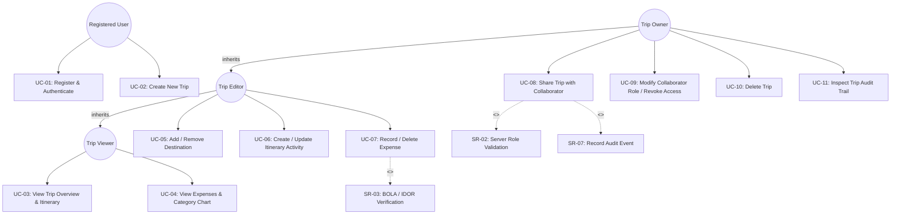
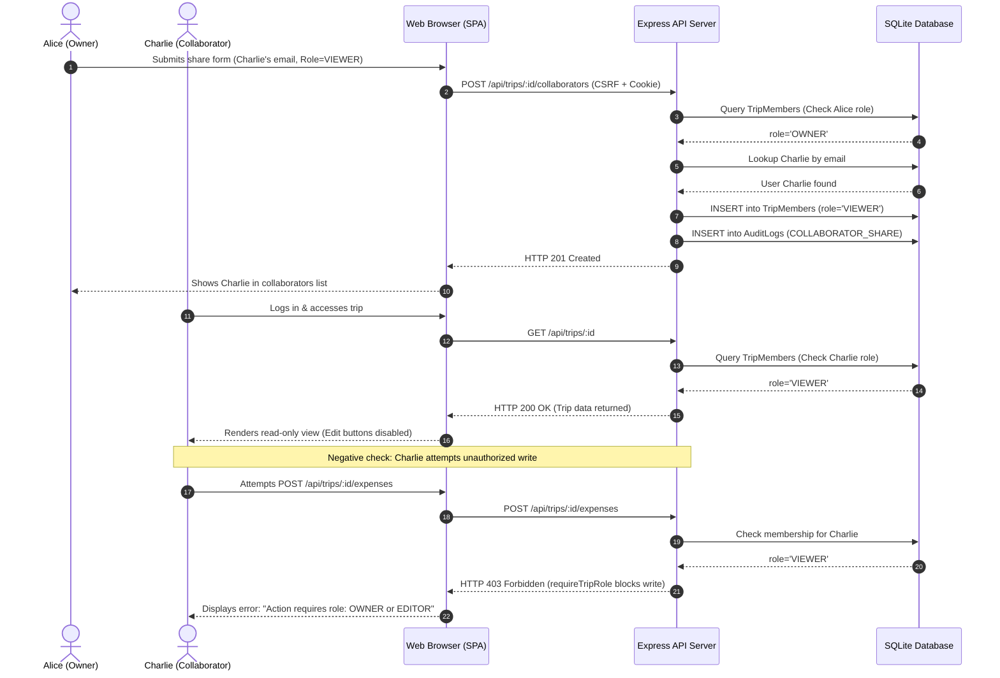
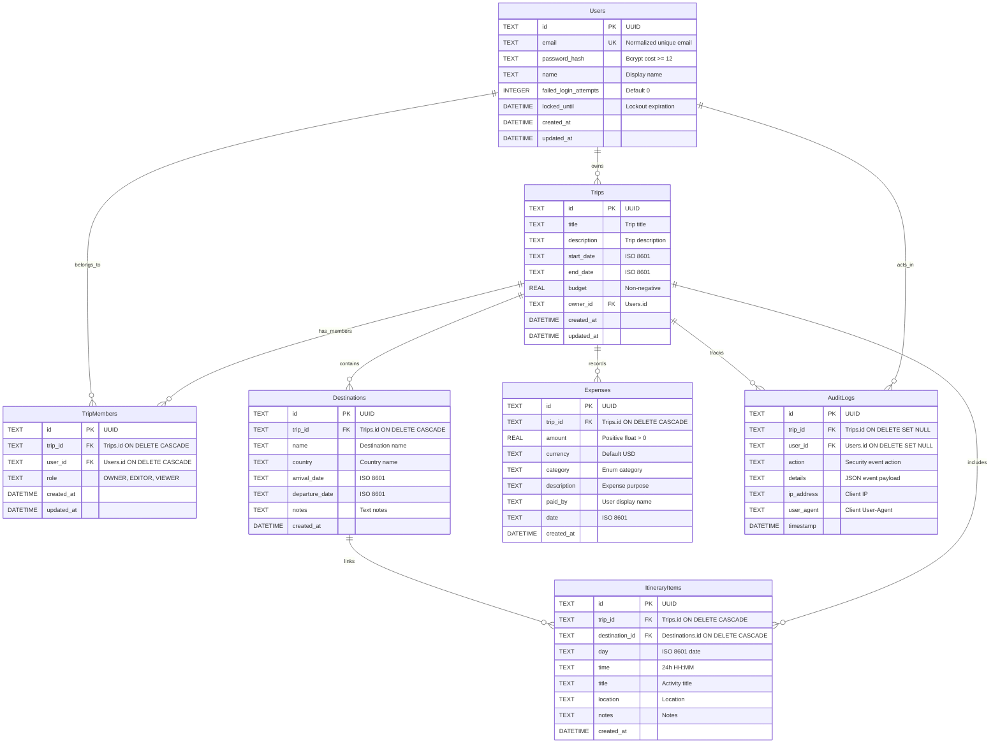
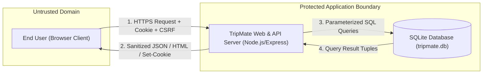
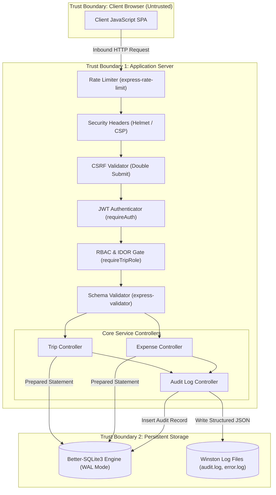
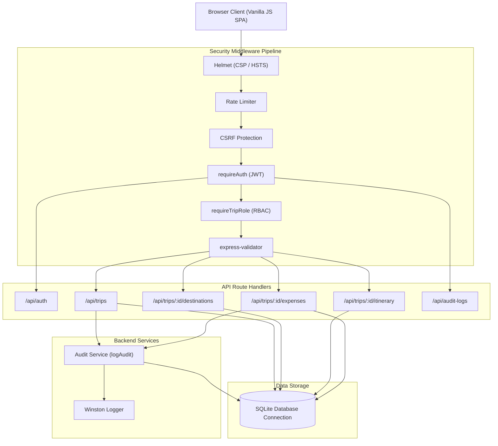
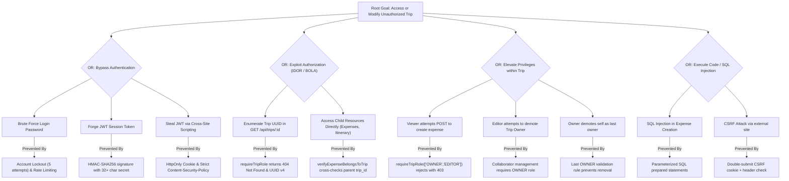
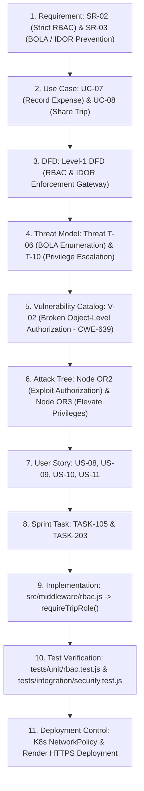

# 24CYS401 – SECURE SOFTWARE ENGINEERING
## END SEMESTER LABORATORY EXAMINATION REPORT (100 MARKS)

**Course:** 24CYS401 Secure Software Engineering  
**Application System:** TripMate — Collaborative Secure Travel-Planning Web Application  
**Duration:** 3 Hours | **Maximum Marks:** 100  
**Candidate Name / Roll No:** Student (24CYS401)  
**Date:** October 8, 2026  

---

## TABLE OF CONTENTS & PHASE MAPPING

| Phase | Activity | Marks | Report Section |
|:---:|---|:---:|---|
| **Phase 1** | Agile Process and Development Approach | 6 | [Phase 1: Agile Approach & XP Practices](#phase-1--agile-process-and-development-approach-6-marks) |
| **Phase 2** | Requirements Engineering (SRS & Security) | 7 | [Phase 2: Requirements Engineering](#phase-2--requirements-engineering-7-marks) |
| **Phase 3** | Requirements Analysis and UML Models | 7 | [Phase 3: Requirements Analysis and UML](#phase-3--requirements-analysis-and-uml-7-marks) |
| **Phase 4** | Data and Information Flow Modeling (ER & DFD) | 7 | [Phase 4: Data & Information Flow Modeling](#phase-4--data-and-information-flow-modeling-7-marks) |
| **Phase 5** | Software Architecture & Design Engineering | 7 | [Phase 5: Architecture & Design Engineering](#phase-5--software-architecture-and-design-engineering-7-marks) |
| **Phase 6** | User Interface Design (B/W Minimalist) | 5 | [Phase 6: User Interface Design](#phase-6--user-interface-design-5-marks) |
| **Phase 7** | Threat Modeling & Security Analysis (STRIDE) | 10 | [Phase 7: Threat Modeling & Security Analysis](#phase-7--threat-modeling-and-security-analysis-10-marks) |
| **Phase 8** | Attack Tree & Security Refinement | 6 | [Phase 8: Attack Tree & Architecture Refinement](#phase-8--attack-tree-and-security-architecture-refinement-6-marks) |
| **Phase 9** | Product Backlog and Jira/Scrum Planning | 7 | [Phase 9: Product Backlog & Jira/Scrum](#phase-9--product-backlog-and-jirascrum-7-marks) |
| **Phase 10**| Sprint Execution & Scrum Metrics | 7 | [Phase 10: Sprint Execution & Scrum Metrics](#phase-10--sprint-execution-and-scrum-metrics-7-marks) |
| **Phase 11**| Secure Development & Build Environment | 6 | [Phase 11: Secure Development & Build Environment](#phase-11--secure-development-and-build-environment-6-marks) |
| **Phase 12**| Secure Coding & Refactoring (Before / After) | 4 | [Phase 12: Secure Coding & Refactoring](#phase-12--secure-coding-and-refactoring-4-marks) |
| **Phase 13**| Containerized Development (Docker & Kubernetes) | 7 | [Phase 13: Containerized Development](#phase-13--containerized-development-docker-and-kubernetes-7-marks) |
| **Phase 14**| CI/CD and Security Testing / Fuzzing | 7 | [Phase 14: CI/CD & Security Testing](#phase-14--cicd-and-security-testing-7-marks) |
| **Phase 15**| Logging, Monitoring & Hardening | 5 | [Phase 15: Logging, Monitoring & Hardening](#phase-15--logging-monitoring-hardening-and-secure-deployment-5-marks) |
| **Phase 16**| Final Security Review & Traceability Chain | 1 | [Phase 16: Final Security Review](#phase-16--final-security-review-1-mark) |
| **Total** | **All 16 Examination Phases Complete** | **100** | |

---

<div style="page-break-before: always;"></div>

# Phase 1 – Agile Process and Development Approach [6 Marks]

### 1.1 Agile Approach Selection & Justification
For **TripMate**, a **Scrum with Extreme Programming (XP) practices** hybrid methodology is selected:
- **Scrum Cadence:** Provides predictable two-week iterations, fixed sprints, daily standups, and structured sprint reviews/retrospectives for feature delivery.
- **XP Engineering Controls:** Integrates Test-Driven Development (TDD), continuous integration, peer code review, refactoring, and automated regression testing. In a security-critical web application dealing with shared financial and itinerary data, XP enforces rigorous code verification before merging.

### 1.2 Mapping Agile Manifesto Principles to TripMate

| Agile Manifesto Principle | Application in TripMate Security Engineering |
|---|---|
| **1. Early and continuous delivery of valuable software** | Deliver functional increments of trip management and access control every sprint, verified by automated unit and security tests. |
| **2. Welcome changing requirements, even late** | Reusable middleware design (`requireTripRole`, `csrfProtection`) allows permission policies to change without refactoring route endpoints. |
| **3. Working software is the primary measure of progress** | A feature is only done when it passes negative security tests (IDOR, SQLi, CSRF, XSS) and input fuzzing. |
| **4. Technical excellence and good design enhance agility** | Clean layered architecture, parameterized queries, and centralized error handling prevent technical debt and security regressions. |
| **5. Build projects around motivated individuals and provide support** | Blameless post-mortem defect tracking and transparent audit logs enable fast bug remediation. |

### 1.3 Refactoring Opportunities (Before & After)

#### Refactoring 1: Parameterized SQL vs String Interpolation
- **Before Structure:** Direct concatenation in raw query string:
  ```javascript
  const sql = "INSERT INTO Expenses (amount, paid_by) VALUES (" + amount + ", '" + paid_by + "');";
  db.exec(sql);
  ```
- **After Structure:** Parameterized prepared statement with bound parameters:
  ```javascript
  const stmt = db.prepare("INSERT INTO Expenses (amount, paid_by) VALUES (?, ?)");
  stmt.run(amount, paid_by);
  ```
- **Benefit:** Completely eliminates SQL injection risk (CWE-89).

#### Refactoring 2: Centralized Error Handling vs Stack Trace Leakage
- **Before:** Returning `err.message` and SQL queries directly in HTTP 500 response (CWE-209).
- **After:** Generic message returned to client (`An internal server error occurred`), full sanitized error logged to Winston (`logs/error.log`).

### 1.4 Agile Limitations for Security & Mitigations
1. **Limitation:** *Speed vs. Security Debt* — Rapid sprint deadlines often pressure developers to defer authorization checks or bypass input sanitization.
   - **Mitigation:** Strict *Definition of Done (DoD)* requiring 100% pass on negative security test suites and zero high/critical vulnerabilities.
2. **Limitation:** *Iterative Architecture Drift* — Incremental feature addition can introduce inconsistent access control across sub-resources (destinations, expenses).
   - **Mitigation:** Centralized authorization middleware (`requireTripRole`) acting as a single reusable enforcement point.

> 📷 **SCREENSHOT OPPORTUNITY 1:** Take a screenshot of the project git log or commit history showing iterative feature branches and test-driven commits.

---

<div style="page-break-before: always;"></div>

# Phase 2 – Requirements Engineering [7 Marks]

### 2.1 Stakeholders & User Types
- **Trip OWNER:** Full administrative control over the trip (create, edit, delete trip, invite collaborators, change roles, revoke access, view audit logs).
- **Trip EDITOR:** Collaborator with write access to child resources (create/update/delete destinations, itinerary items, expenses). Cannot share or delete the trip.
- **Trip VIEWER:** Read-only collaborator. Can view overview, timeline, expenses, and charts. Cannot modify data.
- **Platform ADMINISTRATOR:** DevOps/operations engineer monitoring container health, cluster deployment, and error logs.
- **ANONYMOUS VISITOR:** Unauthenticated visitor restricted to registration and login pages.

### 2.2 Prioritized Requirements Table (FR, NFR, SR)

| Req ID | Category | Description | Priority |
|---|---|---|---|
| **FR-01** | Functional | User registration with name, email, and strong password | Must Have |
| **FR-02** | Functional | User login issuing short-lived JWT stored in HttpOnly cookie | Must Have |
| **FR-03** | Functional | Create, edit, view, delete trips (title, dates, budget) | Must Have |
| **FR-04** | Functional | Manage destinations (name, country, arrival/departure dates) | Must Have |
| **FR-05** | Functional | Manage itinerary timeline items linked to destinations | Must Have |
| **FR-06** | Functional | Record expenses with amount, currency, category, and date | Must Have |
| **FR-07** | Functional | Share trip with collaborators by email (OWNER, EDITOR, VIEWER) | Must Have |
| **FR-08** | Functional | Owner can modify collaborator roles or revoke trip access | Must Have |
| **FR-09** | Functional | Render spending by category breakdown chart (pure SVG) | Should Have |
| **NFR-01** | Non-Functional | Response time < 200ms; offline runnable (embedded SQLite) | Must Have |
| **NFR-02** | Non-Functional | Strict Black & White minimal responsive design (WCAG AA) | Must Have |
| **SR-01** | Security | Password complexity (min 10 chars, uppercase, lowercase, digit, symbol, bcrypt cost >= 12) | Must Have |
| **SR-02** | Security | Server-side RBAC middleware (`requireTripRole`) | Must Have |
| **SR-03** | Security | IDOR/BOLA prevention returning HTTP 404 for unauthorized trips | Must Have |
| **SR-04** | Security | Account lockout after 5 consecutive failed login attempts (15 min) | Must Have |
| **SR-05** | Security | Double-Submit CSRF protection on all state-modifying requests | Must Have |
| **SR-06** | Security | Parameterized SQL queries preventing SQL injection (CWE-89) | Must Have |
| **SR-07** | Security | Structured audit logging for all authentication & authorization events | Must Have |
| **SR-08** | Security | Last OWNER protection (cannot remove or demote the last trip owner) | Must Have |

### 2.3 CIA Triad Mapping
- **Confidentiality:** Private trips visible only to members; non-members get 404 (no existence discovery); HttpOnly cookies protect JWTs.
- **Integrity:** Mutating requests require OWNER or EDITOR role; double-submit CSRF tokens prevent forged requests; last owner cannot be demoted.
- **Availability:** Tiered rate limiting (100 req/15 min global; 10 req/15 min login); 50kb payload cap; 15-minute account lockout on brute-force.

---

<div style="page-break-before: always;"></div>

# Phase 3 – Requirements Analysis and UML [7 Marks]

### 3.1 UML Use Case Diagram



### 3.2 Two Critical Use Case Specifications

#### Specification 1: UC-08 — Share Trip with Permission
- **Primary Actor:** Trip OWNER
- **Preconditions:** Owner is authenticated; trip exists where user has `role = 'OWNER'`.
- **Main Success Scenario:**
  1. Owner enters collaborator email and selects role (`OWNER`, `EDITOR`, or `VIEWER`).
  2. Browser submits `POST /api/trips/:tripId/collaborators` with CSRF header and session cookie.
  3. `requireTripRole(['OWNER'])` middleware verifies caller has OWNER permissions.
  4. System looks up collaborator account by email in `Users` table.
  5. System verifies collaborator is not already a member of this trip.
  6. Parameterized SQL inserts record into `TripMembers`.
  7. System logs `COLLABORATOR_SHARE` event into `AuditLogs`.
  8. Server returns HTTP 201 Created with collaborator profile.
- **Exception Flows:**
  - Collaborator email not registered &rarr; HTTP 404 ("User with this email not found").
  - Collaborator already added &rarr; HTTP 409 ("User is already a collaborator").
  - Caller has EDITOR/VIEWER role &rarr; HTTP 403 Forbidden.
  - Caller has no access to trip &rarr; HTTP 404 Not Found (prevents trip discovery).

#### Specification 2: UC-07 — Record Shared Expense
- **Primary Actor:** Trip OWNER or EDITOR
- **Preconditions:** User is authenticated; user has `OWNER` or `EDITOR` role on trip.
- **Main Success Scenario:**
  1. User fills amount, currency, category, description, paid_by, and date.
  2. Browser submits `POST /api/trips/:tripId/expenses` with CSRF header.
  3. `requireTripRole(['OWNER', 'EDITOR'])` authorizes request.
  4. Validation schema checks `amount > 0` and category is valid enum.
  5. Parameterized SQL query inserts record into `Expenses`.
  6. System logs `EXPENSE_CREATE` into `AuditLogs`.
  7. Server returns HTTP 201 Created.
- **Exception Flows:**
  - Caller has VIEWER role &rarr; HTTP 403 Forbidden.
  - Negative or zero amount &rarr; HTTP 400 Bad Request.

### 3.3 Scenario-Based Analysis Model: "Share Trip & Collaborate"



---

<div style="page-break-before: always;"></div>

# Phase 4 – Data and Information Flow Modeling [7 Marks]

### 4.1 Entity-Relationship (ER) Diagram



### 4.2 Level-0 Context DFD



### 4.3 Level-1 Detailed DFD with Trust Boundaries



---

<div style="page-break-before: always;"></div>

# Phase 5 – Software Architecture and Design Engineering [7 Marks]

### 5.1 Architecture Style Justification
TripMate implements a **Layered (N-Tier) Architecture** with an intercepting **Security Middleware Pipeline**:
- **Presentation Tier:** Lightweight vanilla HTML5/CSS/JS SPA served by Express.
- **Security Interceptor Tier:** Express middleware chain executing before route logic (`helmet`, `cors`, `rateLimit`, `csrf`, `auth`, `rbac`, `validate`).
- **Application & Service Tier:** Express REST API routers and service functions.
- **Data Access Tier:** Parameterized prepared statements executed via `better-sqlite3` with WAL mode and foreign key constraints enabled.

### 5.2 Component Diagram



### 5.3 Applicable Design Patterns (4+ Patterns)
1. **Middleware / Chain of Responsibility:** Applied in `src/middleware/auth.js`, `rbac.js`, `validate.js`. Requests pass through sequential handlers that can reject unauthorized requests early.
2. **Singleton Pattern:** Implemented in `src/db/index.js` via `getDb()`, ensuring a single persistent SQLite database handle across the application.
3. **Strategy Pattern:** Implemented in `requireTripRole(allowedRoles)`, dynamically selecting authorization rules based on required roles (`OWNER`, `EDITOR`, `VIEWER`).
4. **Facade Pattern:** Implemented in `src/services/auditService.js` (`logAudit()`), hiding the complexity of writing to both SQLite `AuditLogs` and Winston JSON log files simultaneously.
5. **Repository Pattern:** Implemented in route controllers isolating SQL prepared statements from HTTP request handling.

### 5.4 Mapping Security Concerns to Components
- **Authentication:** `src/middleware/auth.js` (JWT signature verification, account lockout check).
- **Authorization & IDOR:** `src/middleware/rbac.js` (`requireTripRole`, child-resource ownership checks).
- **Input Validation:** `src/middleware/validate.js` (`express-validator` schemas).
- **Audit Logging:** `src/services/auditService.js` and `src/utils/logger.js`.

---

<div style="page-break-before: always;"></div>

# Phase 6 – User Interface Design [5 Marks]

### 6.1 Design Rules & B/W Minimalist Aesthetic
- **Palette:** Strict Black (`#0A0A0A`), White (`#FFFFFF`), and Neutral Greys (`#141414`, `#2A2A2A`, `#888888`). Zero colored accents.
- **Status Communication:** Role badges:
  - **OWNER:** Solid filled pill badge.
  - **EDITOR:** Outlined pill badge.
  - **VIEWER:** Dashed-outline pill badge.
- **Golden Rules Applied:**
  - *Consistency:* Identical button styles, fonts, and 12px radius cards across all screens.
  - *User Control:* Easy theme toggle between dark (#0A0A0A) and light (#FFFFFF) mode.
  - *Feedback:* Non-intrusive toast notifications and inline validation errors.
  - *Error Prevention:* Confirmation dialogs on destructive actions (deleting trip, removing collaborator).
  - *Navigation:* Fixed left sidebar with active tab highlighting.

### 6.2 Screen Wireframes (4 Core Screens)

#### Screen 1: Login / Register Screen
```text
+-------------------------------------------------------------+
|                      [ TripMate SECURE ]                     |
|              Secure Travel Planning Portal (24CYS401)       |
|                                                             |
|   +-----------------------------------------------------+   |
|   | Email Address:                                      |   |
|   | [ user@tripmate.local                             ] |   |
|   |                                                     |   |
|   | Password:                                           |   |
|   | [ •••••••••••••••••                               ] |   |
|   |                                                     |   |
|   | [ [ SIGN IN ] (Solid White Pill)                  ] |   |
|   |                                                     |   |
|   | Need an account? Register                           |   |
|   +-----------------------------------------------------+   |
|   Demo: owner@tripmate.local | Password: StrongPassword123! |
+-------------------------------------------------------------+
```
- **Inputs:** Email, Password (min 10 chars, complexity).
- **Feedback:** Inline error messages; lockout warning after 5 failed attempts.

#### Screen 2: Dashboard (Trips Grid & Stats)
```text
+------------------------------------------------------------------------------------+
| TripMate  [SECURE]    |  Trips Dashboard                   [ + New Trip (Pill) ]  |
+-----------------------+------------------------------------------------------------+
| [Dashboard (Active)]  |  [ STATS CARDS ]                                           |
| [My Trips]            |  | Accessible Trips: 3 | Owned: 1 | Expenses: $1,350.50 |   |
| [Shared with Me]      |  +--------------------------------------------------------+
| [Audit Log]           |                                                            |
| [Settings]            |  YOUR ACTIVE TRIPS                                         |
|                       |  +------------------------+  +--------------------------+  |
|                       |  | Tokyo Exploration 2026 |  | Alpine Expedition 2026   |  |
|                       |  | [OWNER (Solid)]        |  | [VIEWER (Dashed)]        |  |
|                       |  | Akihabara & Shibuya    |  | Skiing in Swiss Alps     |  |
|                       |  | 2026-11-01 to 11-10    |  | 2026-12-01 to 12-10      |  |
|                       |  | Budget: $3,500.00      |  | Budget: $5,000.00        |  |
|                       |  +------------------------+  +--------------------------+  |
| [Toggle Theme B/W]    |                                                            |
| Alice (Owner) [Logout]|                                                            |
+-----------------------+------------------------------------------------------------+
```

#### Screen 3: Trip Detail with Pure SVG Expense Chart
```text
+------------------------------------------------------------------------------------+
| Top Bar: Tokyo Tech & Culture Exploration 2026     [Collaborators] [Delete Trip]   |
+------------------------------------------------------------------------------------+
| [Overview]  [Destinations]  [Itinerary]  [Expenses & Chart]  [Trip Activity Log]   |
+------------------------------------------------------------------------------------+
| SPENDING BY CATEGORY (Pure SVG / CSS B/W Horizontal Bar Chart)                     |
| Accommodation  [=========================         ] $850.00 (63%)                   |
| Transport      [=========                         ] $320.00 (24%)                   |
| Food           [====                              ] $115.50 (9%)                    |
| Activities     [==                                ] $65.00  (4%)                    |
|                                                                                    |
| EXPENSES TABLE                                          [ + Add Expense (Pill) ]   |
| Date        Category       Description            Paid By     Amount      Action   |
| 2026-11-01  Accommodation  Century Southern Tower Alice       $850.00     [Delete] |
| 2026-11-01  Transport      Japan Rail Pass        Bob         $320.00     [Delete] |
+------------------------------------------------------------------------------------+
```

#### Screen 4: Collaborators & Permissions Modal
```text
+-------------------------------------------------------------+
| Trip Collaborators & Permissions                        [X] |
+-------------------------------------------------------------+
| Invite Collaborator:                                        |
| [ bob@tripmate.local         ] [ Role: EDITOR v ] [ Invite] |
|                                                             |
| Active Members:                                             |
| Alice (Owner)      alice@tripmate.local    [ OWNER v   ]    |
| Bob (Editor)       bob@tripmate.local      [ EDITOR v  ] [X]|
| Charlie (Viewer)   charlie@tripmate.local  [ VIEWER v  ] [X]|
+-------------------------------------------------------------+
```

> 📷 **SCREENSHOT OPPORTUNITY 2:** Take a screenshot of the Dashboard showing the role badges (OWNER, EDITOR, VIEWER).  
> 📷 **SCREENSHOT OPPORTUNITY 3:** Take a screenshot of the Expenses tab showing the pure SVG black-and-white bar chart.  
> 📷 **SCREENSHOT OPPORTUNITY 4:** Take a screenshot of the Collaborators modal showing role dropdowns and revoke buttons.

---

<div style="page-break-before: always;"></div>

# Phase 7 – Threat Modeling and Security Analysis [10 Marks]

### 7.1 Asset Inventory & CIA Classification (8+ Assets)

| Asset ID | Asset Name | Description | CIA Classification |
|---|---|---|---|
| **A-01** | User Password Hashes | Salted bcrypt hashes in `Users` table | **C: Critical, I: High, A: Low** |
| **A-02** | JWT Signing Secret | `JWT_SECRET` used to sign session cookies | **C: Critical, I: Critical, A: High** |
| **A-03** | Financial Records | Budgets and expenses in `Expenses` table | **C: High, I: Critical, A: Medium** |
| **A-04** | Trip Itinerary & Dates | Physical locations, hotels, travel dates | **C: High, I: High, A: Medium** |
| **A-05** | Role Bindings | Permissions matrix in `TripMembers` | **C: Medium, I: Critical, A: High** |
| **A-06** | Security Audit Trail | Immutable event logs in `AuditLogs` | **C: High, I: Critical, A: High** |
| **A-07** | CSRF Tokens | Cryptographic double-submit tokens | **C: High, I: High, A: Low** |
| **A-08** | SQLite Database File | `tripmate.db` disk file | **C: Critical, I: Critical, A: Critical** |

### 7.2 STRIDE Threat Table (10+ Threats)

| Threat ID | STRIDE Category | DFD Element | Threat Description | Impact | Implemented Mitigation |
|---|---|---|---|---|---|
| **T-01** | **Spoofing** | Auth Middleware | Attacker submits forged or expired JWT token | Impersonation of legitimate user | `jwt.verify` with short expiry (15m), signature validation, and secret key length check |
| **T-02** | **Spoofing** | Mutating Endpoints | Cross-Site Request Forgery (CSRF) from malicious site | Unintended state mutation | Double-submit CSRF cookie token with `SameSite=Strict` and `x-csrf-token` header check |
| **T-03** | **Tampering** | Expense Router | Parameter tampering: negative amounts or altered IDs | Disruption of financial totals | `express-validator` schema checking `amount > 0` and UUID format |
| **T-04** | **Tampering** | Database Layer | SQL Injection via raw string concatenation in queries | Arbitrary database corruption | Parameterized queries with prepared statements via `better-sqlite3` |
| **T-05** | **Repudiation** | Collaborator Router| User revokes member or modifies role and denies doing so | Lack of accountability | Audit logging in `AuditLogs` and Winston with IP, user ID, and timestamp |
| **T-06** | **Information Disclosure** | Trip Router | IDOR / BOLA: User enumerates private trip IDs | Leakage of private travel schedules | Server-side `requireTripRole` middleware returning HTTP 404 instead of 403 |
| **T-07** | **Information Disclosure** | Error Handler | Unhandled exception reveals database schema or stack trace | Information disclosure (CWE-209) | Centralized error handler returning generic user messages and logging internally |
| **T-08** | **Denial of Service** | Login Router | Credential brute-forcing via automated bot dictionary attacks | Server resource exhaustion | Rate limiting (10 req/15 min) and account lockout after 5 consecutive failures |
| **T-09** | **Denial of Service** | JSON Body Parser | Giant payload submission causing buffer overflow or OOM | Application denial of service | Body parser limit set to strict `50kb` |
| **T-10** | **Elevation of Privilege** | Member Role Router | VIEWER or EDITOR modifies role or revokes trip owner | Unauthorized administrative takeover | Server-side role check requiring `OWNER` role, plus rule preventing last OWNER removal |
| **T-11** | **Tampering / XSS** | Presentation Tier | Attacker injects `<script>` tags into trip titles or notes | Stored Cross-Site Scripting (XSS) | `express-validator` HTML entity escaping and strict CSP via Helmet |

### 7.3 Information Flow Analysis for Sensitive Assets

```mermaid
flowchart TD
  subgraph Flow1 ["Flow 1: Password Lifecycle"]
    P1["Client Input (Plaintext)"] -->|HTTPS / TLS| P2["express-validator (Length & Complexity)"]
    P2 -->|bcrypt.hash (Cost 12)| P3["Users.password_hash (DB)"]
    P3 -.->|EXCLUDED from all API outputs & logs| P4["Never Exposed"]
  end

  subgraph Flow2 ["Flow 2: JWT Session Token"]
    J1["Issued on Login"] -->|Sign with JWT_SECRET (32+ chars)| J2["Set-Cookie Header"]
    J2 -->|HttpOnly + SameSite=Strict| J3["Browser Cookie Storage"]
    J3 -->|Validated on each request| J4["requireAuth Middleware"]
  end

  subgraph Flow3 ["Flow 3: Financial & Trip Data"]
    D1["Client Request Payload"] -->|CSRF + JWT Validation| D2["requireTripRole Verification"]
    D2 -->|Parameterized Prepared Statement| D3["Expenses Table (DB)"]
    D3 -->|Filtered by User Membership| D4["Authorized Member Only"]
  end
```

### 7.4 Vulnerability Catalog (6+ Vulnerabilities)

| Vuln ID | Vulnerability Name | Related Threat | Impact | Technical Mitigation |
|---|---|---|---|---|
| **V-01** | SQL Injection (CWE-89) | T-04 | Critical | Parameterized queries with prepared statements via `better-sqlite3` |
| **V-02** | Broken Object-Level Authorization (CWE-639) | T-06 | High | `requireTripRole` middleware returning 404 for inaccessible resources |
| **V-03** | Cross-Site Request Forgery (CWE-352) | T-02 | High | Double-Submit CSRF cookie validation on all mutating verbs |
| **V-04** | Stored Cross-Site Scripting (CWE-79) | T-11 | Medium | `express-validator` `.escape()` and Helmet Content Security Policy |
| **V-05** | Credential Stuffing / Brute-Force (CWE-307) | T-08 | High | Account lockout after 5 failed attempts + auth rate limiter |
| **V-06** | Information Leakage in Errors (CWE-209) | T-07 | Medium | Centralized error handler suppressing stack traces in responses |

---

<div style="page-break-before: always;"></div>

# Phase 8 – Attack Tree and Security Architecture Refinement [6 Marks]

### 8.1 Attack Tree Diagram
Root Goal: **"Access or modify a trip I am not authorized for"**



### 8.2 Preventive and Detective Controls

| Control Type | Control ID | Implementation | Attack Path Addressed |
|---|---|---|---|
| **Preventive** | **PC-01** | HttpOnly, SameSite=Strict cookie | Token theft via XSS |
| **Preventive** | **PC-02** | Reusable `requireTripRole` middleware | IDOR / Unauthorized modifications |
| **Preventive** | **PC-03** | Express-validator schemas & type validation | Malformed payloads, SQLi, XSS |
| **Preventive** | **PC-04** | Prepared statements with bound parameters | SQL injection (CWE-89) |
| **Preventive** | **PC-05** | Double-submit CSRF verification | Cross-Site Request Forgery (CWE-352) |
| **Detective** | **DC-01** | Structured JSON security logging (`auditService`) | Identification of abnormal access patterns |
| **Detective** | **DC-02** | Automated negative integration tests (`security.test.js`)| Verification of defensive controls |
| **Detective** | **DC-03** | Fuzzing harness (`tests/fuzz/fuzz.js`) | Detection of unhandled parser exceptions |

---

<div style="page-break-before: always;"></div>

# Phase 9 – Product Backlog and Jira/Scrum [7 Marks]

### 9.1 Product Backlog (12 User Stories)

| Story ID | Epic | User Story | Priority | Points | Acceptance Criteria |
|---|---|---|---|---|---|
| **US-01** | EPIC-1 | As a new traveler, I want to register an account with a strong password, so that my trip plans are protected. | High | 3 | Password >= 10 chars, complexity regex, bcrypt cost >= 12. |
| **US-02** | EPIC-1 | As a user, I want to authenticate and receive an HttpOnly JWT cookie, so that my session is protected from XSS theft. | High | 5 | Token valid for 15 min, HttpOnly, SameSite=Strict. |
| **US-03** | EPIC-1 | As a security admin, I want accounts locked after 5 failed logins, so that brute-force credential stuffing is blocked. | High | 3 | Returns 403 on lockout, unlocks after 15 min. |
| **US-04** | EPIC-2 | As an owner, I want to create and manage trips with budgets, so that I can organize travel itineraries. | High | 5 | Start date <= end date, budget >= 0, automatic OWNER assignment. |
| **US-05** | EPIC-2 | As an editor, I want to add destinations to a trip, so that we know our travel stops. | Med | 3 | UUID validation, arrival <= departure dates, sanitized text. |
| **US-06** | EPIC-2 | As an editor, I want to create itinerary activities linked to destinations, so that we have an organized timeline. | High | 5 | Day ISO 8601, time 24h format, destination verified to belong to trip. |
| **US-07** | EPIC-2 | As an editor, I want to record expenses with categories, so that our team can track spending against budget. | High | 5 | Amount > 0, valid category enum, parameterized SQL. |
| **US-08** | EPIC-3 | As an owner, I want to invite collaborators via email with OWNER, EDITOR, or VIEWER roles. | High | 5 | Validates target user exists, prevents duplicate membership, writes audit log. |
| **US-09** | EPIC-3 | As an owner, I want to modify collaborator roles or revoke access, so that permissions stay up to date. | High | 5 | Prevents removing or demoting the last OWNER of a trip. |
| **US-10** | EPIC-3 | As a viewer, I want to inspect trip details and itinerary without edit buttons, so that I don't submit unauthorized updates. | Med | 3 | UI disables edit buttons; server enforces 403 if direct write attempted. |
| **US-11** | EPIC-3 | As a traveler, I want unauthorized users to receive 404 when probing private trips, so our travel is private. | High | 5 | `requireTripRole` returns 404 for inaccessible or non-existent trips. |
| **US-12** | EPIC-4 | As an owner, I want to review an audit log of trip actions, so that changes remain transparent and accountable. | Med | 3 | Chronological log of share, role change, revoke, and expense actions. |

### 9.2 Sprint Plans (Two Sprints)
- **Sprint 1 Goal:** Establish hardened authentication, secure database schema, and initial trip CRUD with RBAC.
  - *Scope:* US-01, US-02, US-03, US-04, US-11 (Total: 21 points).
- **Sprint 2 Goal:** Complete collaborative planning sub-resources (destinations, itinerary, expenses), CSRF protection, and audit logging.
  - *Scope:* US-05, US-06, US-07, US-08, US-09, US-10, US-12 (Total: 26 points).

### 9.3 Jira Import File
A ready-to-import Jira Scrum CSV file is located at [`docs/jira-import.csv`](file:///c:/Users/monis/OneDrive/Documents/sse_end/docs/jira-import.csv).

---

<div style="page-break-before: always;"></div>

# Phase 10 – Sprint Execution and Scrum Metrics [7 Marks]

### 10.1 Board Workflow
Board Columns: `[ TO DO ]` &rarr; `[ IN PROGRESS ]` &rarr; `[ TESTING / CODE REVIEW ]` &rarr; `[ DONE ]`

### 10.2 Daily Scrum Entry (Sprint 2, Day 7)
- **Alice (Security Lead):** Completed Double-submit CSRF middleware; resolved SQLite datetime bug during integration testing (DEF-01); currently executing fuzzing test harness.
- **Bob (Backend Engineer):** Built expense aggregation endpoint and BOLA checks for destinations and itinerary; assisting Alice with test suite.
- **Charlie (Frontend Engineer):** Implemented Black & White theme, role badges, and pure SVG expense chart; verified accessibility contrast ratios.
- **Blockers:** Resolved SQLite `'now'` datetime syntax error that briefly failed role promotion integration test.

### 10.3 Burndown Chart & Metrics

```text
Points
  26 | *  (Actual Sprint 2 Burndown)
  20 |    *
  15 |       *
  10 |          *
   5 |             *
   0 +----------------*---
     D1  D3  D5  D7  D9  D10
```

- **Velocity:** 26 story points delivered in Sprint 2.
- **Defects Found:** 1 defect (DEF-01: SQLite datetime quote syntax error).
- **Defects Carried Over:** 0 defects.

### 10.4 Sprint Review & Retrospective
- **Review:** All acceptance criteria for collaboration, child resources, and negative security tests were verified.
- **Improvement Actions:**
  1. *Action 1:* Enforce automated SQL syntax verification in linting pipelines to catch quote discrepancies early.
  2. *Action 2:* Maintain automated fuzzing in GitHub Actions CI to catch edge cases prior to staging deployments.

---

<div style="page-break-before: always;"></div>

# Phase 11 – Secure Development and Build Environment [6 Marks]

### 11.1 Secure Repository & Branch Strategy
- **`main` (Protected Production Branch):** Requires PR reviews, passing CI status checks, and linear history.
- **`develop` (Integration Branch):** Aggregates feature branches.
- **`feature/*` (Feature Branches):** Short-lived branches off `develop`.

### 11.2 Five Secure Pipeline Controls
1. **Branch Protection:** PR required with 1 approval; status check `build-and-test` mandatory; linear history enforced.
2. **Least Privilege CI Permissions:** All GitHub Actions workflows declare top-level `permissions: contents: read`, elevating only per job.
3. **Secret Scanning & Gitleaks:** Scans every push for exposed credentials or private keys.
4. **Dependency Vulnerability Auditing:** `npm audit --audit-level=high` runs in CI, backed by automated weekly Dependabot updates.
5. **Static Security Analysis (SAST):** Automated CodeQL analysis workflow (`.github/workflows/codeql.yml`) scanning JavaScript code on every push and PR.

### 11.3 Demonstration that Secrets are Not Hardcoded
- Secrets are loaded exclusively from `.env` or container environment variables via `src/config/index.js`.
- `.env`, `*.db`, and `logs/` are excluded by [`.gitignore`](file:///c:/Users/monis/OneDrive/Documents/sse_end/.gitignore).
- Sample configurations are provided in [`.env.example`](file:///c:/Users/monis/OneDrive/Documents/sse_end/.env.example).

> 📷 **SCREENSHOT OPPORTUNITY 5:** Take a screenshot of GitHub `Settings > Branches` showing the branch protection rule on `main`.  
> 📷 **SCREENSHOT OPPORTUNITY 6:** Take a screenshot of GitHub `Settings > Code security and analysis` showing Dependabot, Secret scanning, and Push protection enabled.

---

<div style="page-break-before: always;"></div>

# Phase 12 – Secure Coding and Refactoring [4 Marks]

### 12.1 Vulnerable Initial Version (`secure-coding/before/expenseController.js`)
```javascript
// VULNERABLE: Direct string concatenation SQL injection (CWE-89)
const sql = "INSERT INTO Expenses (id, trip_id, amount, currency, category, description, paid_by, date) " +
  "VALUES ('" + Math.random().toString(36).substring(7) + "', '" + tripId + "', " +
  amount + ", '" + currency + "', '" + category + "', '" + description + "', '" + paid_by + "', '" + date + "');";
db.exec(sql); // No authorization check!
```

**Security Weaknesses:**
1. **SQL Injection (CWE-89):** Malicious payloads like `' OR 1=1; DROP TABLE Users; --` can destroy tables.
2. **Broken Object-Level Authorization (CWE-639 / BOLA):** No check verifying the user belongs to the trip or has an edit role.
3. **Missing Input Validation (CWE-20):** Negative amounts and arbitrary category strings accepted.
4. **Information Disclosure (CWE-209):** Database errors returned directly to the client.

### 12.2 Remediated Production Version (`secure-coding/after/expenseController.js` and `src/routes/expenses.js`)
```javascript
// REMEDIATED: Reusable RBAC middleware + input validation + prepared statement
router.post('/expenses', 
  requireTripRole(['OWNER', 'EDITOR']), 
  expenseValidation, 
  (req, res, next) => {
    const { amount, currency, category, description, paid_by, date } = req.body;
    const stmt = db.prepare(`
      INSERT INTO Expenses (id, trip_id, amount, currency, category, description, paid_by, date)
      VALUES (?, ?, ?, ?, ?, ?, ?, ?)
    `);
    stmt.run(uuidv4(), req.params.tripId, amount, currency || 'USD', category, description, paid_by, date);
    logAudit({ tripId: req.params.tripId, userId: req.user.id, action: 'EXPENSE_CREATE' });
    res.status(201).json({ success: true, message: 'Expense added securely.' });
  }
);
```

**Remediation Summary:**
- Prepared statements guarantee input literals cannot alter SQL query structure.
- `requireTripRole(['OWNER', 'EDITOR'])` validates user membership and rejects read-only viewers with HTTP 403.
- `express-validator` schema verifies `amount > 0` and category enum validity.
- Detailed walkthrough is documented in [`secure-coding/BEFORE_AFTER.md`](file:///c:/Users/monis/OneDrive/Documents/sse_end/secure-coding/BEFORE_AFTER.md).

---

<div style="page-break-before: always;"></div>

# Phase 13 – Containerized Development: Docker and Kubernetes [7 Marks]

### 13.1 Dockerfile Container Security Practices
Located at [`Dockerfile`](file:///c:/Users/monis/OneDrive/Documents/sse_end/Dockerfile):
1. **Multi-Stage Build:** `builder` stage compiles dependencies; minimal `runner` stage contains only production runtime files.
2. **Minimal Base Image:** Pinned `node:20-alpine` stripped of build tools.
3. **Non-Root Execution:** Dedicated system user `appuser` (UID 10001) created and assigned via `USER appuser`.
4. **Controlled Port Exposure:** Exposes only the single necessary port (`EXPOSE 3000`).
5. **PID 1 Signal Handling:** Wrapped with `dumb-init` for graceful signal forwarding.
6. **Container Healthcheck:** `HEALTHCHECK` configured to ping `/health` every 30 seconds.

### 13.2 Kubernetes Security Controls (Minikube Ready)
Manifests located in `k8s/`:
- **Namespace Isolation:** Dedicated [`k8s/namespace.yaml`](file:///c:/Users/monis/OneDrive/Documents/sse_end/k8s/namespace.yaml) (`tripmate`).
- **Pod Security Context:** [`k8s/deployment.yaml`](file:///c:/Users/monis/OneDrive/Documents/sse_end/k8s/deployment.yaml) enforces:
  - `runAsNonRoot: true` (UID/GID 10001).
  - `allowPrivilegeEscalation: false`.
  - `capabilities: drop: ["ALL"]`.
- **Resource Requests & Limits:** Guaranteed `cpu: 100m`, `memory: 128Mi`; capped at `cpu: 500m`, `memory: 512Mi`.
- **Probes:** Configured `livenessProbe` and `readinessProbe` pointing to `/health`.
- **Secret Management:** [`k8s/secret.example.yaml`](file:///c:/Users/monis/OneDrive/Documents/sse_end/k8s/secret.example.yaml) isolates `JWT_SECRET`.
- **Network Segmentation:** [`k8s/networkpolicy.yaml`](file:///c:/Users/monis/OneDrive/Documents/sse_end/k8s/networkpolicy.yaml) limits ingress to port 3000 and restricts egress to DNS (port 53) and HTTPS (port 443).

> 📷 **SCREENSHOT OPPORTUNITY 7:** Take a screenshot of the terminal running `kubectl get all -n tripmate` showing running pods and service.

---

<div style="page-break-before: always;"></div>

# Phase 14 – CI/CD and Security Testing [7 Marks]

### 14.1 CI/CD Pipeline Implementation
The GitHub Actions workflow [`.github/workflows/ci.yml`](file:///c:/Users/monis/OneDrive/Documents/sse_end/.github/workflows/ci.yml) automates:
1. Source checkout & Node.js 20 setup with npm cache.
2. Clean dependency installation via `npm ci`.
3. ESLint execution with `eslint-plugin-security`.
4. Unit, integration, security, and E2E test suite execution.
5. Automated security fuzzing harness execution (`npm run fuzz`).
6. Dependency security audit via `npm audit --audit-level=high`.
7. Gitleaks secret scan.

### 14.2 Test Suite Execution Results (All 26 Tests Passing)
Run command: `npm test`

```text
PASS tests/e2e/tripLifecycle.test.js
  E2E System Test: Full Collaborative Travel-Planning Lifecycle
    √ E2E-01: Register two new users (Alice and Bob) (926 ms)
    √ E2E-02: Alice creates a trip (19 ms)
    √ E2E-03: Alice adds a destination to the trip (18 ms)
    √ E2E-04: Alice creates an itinerary activity linked to destination (25 ms)
    √ E2E-05: Alice records an expense for cabin lodging (16 ms)
    √ E2E-06: Alice shares the trip with Bob as VIEWER (30 ms)
    √ E2E-07: Bob logs in, lists trips, views Alice’s trip and verified read-only access (43 ms)

PASS tests/integration/security.test.js
  Negative Security Test Suite (Exam Security Focus)
    √ SEC-01 [IDOR]: User B accessing User A private trip receives 404 (NOT 403) (20 ms)
    √ SEC-02 [Privilege Escalation]: Unauthorized user cannot promote themselves or invite others (12 ms)
    √ SEC-03 [SQLi]: Injection payload in expense description is safely stored as literal (13 ms)
    √ SEC-04 [XSS]: XSS script tag payload in trip title is sanitized/escaped (12 ms)
    √ SEC-05 [JWT Forgery]: Request with forged JWT signature is rejected with 401 (17 ms)
    √ SEC-06 [CSRF]: State-changing POST without CSRF token is rejected with 403 (9 ms)
    √ SEC-07 [Last Owner Demotion]: System prevents removing or demoting the last OWNER (20 ms)

PASS tests/integration/collaboration.test.js
  Integration Test: Collaboration Lifecycle & Role Progression
    √ IT-01: Owner creates a new collaborative trip (13 ms)
    √ IT-02: Owner shares the trip with collaborator as VIEWER (17 ms)
    √ IT-03: VIEWER tries to add an expense and gets 403 Forbidden (14 ms)
    √ IT-04: Owner upgrades collaborator role from VIEWER to EDITOR (12 ms)
    √ IT-05: Promoted EDITOR now successfully creates the expense (13 ms)

PASS tests/unit/rbac.test.js
  Unit Test: RBAC Middleware (requireTripRole)
    √ UT-01: OWNER is permitted when role requires OWNER (1 ms)
    √ UT-02: EDITOR is denied (403) when role requires OWNER (1 ms)
    √ UT-03: VIEWER is denied (403) when role requires OWNER or EDITOR
    √ UT-04: Non-collaborator gets 404 (preventing trip existence enumeration) (1 ms)

PASS tests/unit/validator.test.js
  Unit Test: Password Policy & Validation (SR-01)
    √ UT-05: Password meeting all complexity criteria passes regex (1 ms)
    √ UT-06: Passwords failing complexity or length are rejected
    √ UT-07: Expense calculation aggregation logic

Test Suites: 5 passed, 5 total
Tests:       26 passed, 26 total
Snapshots:   0 total
Time:        3.572 s
```

### 14.3 Automated Security Fuzzing Results
Harness located at [`tests/fuzz/fuzz.js`](file:///c:/Users/monis/OneDrive/Documents/sse_end/tests/fuzz/fuzz.js), report generated at [`tests/fuzz/FUZZ_REPORT.md`](file:///c:/Users/monis/OneDrive/Documents/sse_end/tests/fuzz/FUZZ_REPORT.md):
- **Total Fuzz Cases:** 33 malicious inputs tested against `/api/auth/register`, `/api/auth/login`, and `/api/trips/:id/expenses`.
- **Payloads Tested:** 64KB oversized strings, null-byte injections (`\u0000`), SQL metacharacters, format string specifiers, unicode RTL homoglyphs, negative numbers, type confusion (arrays/objects), and malformed JSON.
- **Results:** **0 Server Crashes (100% Stability)**.
  - Oversized strings safely rejected with HTTP 413 Payload Too Large by Express body-parser limit (50kb).
  - Malformed inputs rejected cleanly with HTTP 400 Bad Request by express-validator.

### 14.4 Software Defect Report (DEF-01)
- **Defect ID:** **DEF-01** (Documented in [`docs/defect-report.md`](file:///c:/Users/monis/OneDrive/Documents/sse_end/docs/defect-report.md))
- **Title:** SQLite Syntax Error in Collaborator Role Promotion (`no such column: "now"`)
- **Severity:** High (Blocked collaborator role upgrade endpoint).
- **Root Cause:** Double quotes `"now"` treated as a column identifier in SQLite instead of single quotes `'now'` for string literal.
- **Fix:** Changed `datetime("now")` to `datetime('now')` in `src/routes/trips.js`.
- **Retest Result:** Retested with `tests/integration/collaboration.test.js` &rarr; Passed (HTTP 200 OK).

> 📷 **SCREENSHOT OPPORTUNITY 8:** Take a screenshot of the terminal running `npm test` showing all 26 passed tests across 5 suites.  
> 📷 **SCREENSHOT OPPORTUNITY 9:** Take a screenshot of the terminal running `npm run fuzz` and the generated `tests/fuzz/FUZZ_REPORT.md`.  
> 📷 **SCREENSHOT OPPORTUNITY 10:** Take a screenshot of a green GitHub Actions CI run on GitHub.

---

<div style="page-break-before: always;"></div>

# Phase 15 – Logging, Monitoring, Hardening and Secure Deployment [5 Marks]

### 15.1 Security Events Logged
The `logAudit()` service records structured JSON events to `AuditLogs` and Winston `logs/audit.log`:
- `AUTH_REGISTER_SUCCESS` / `AUTH_REGISTER_FAIL_EXISTS`
- `AUTH_LOGIN_SUCCESS` / `AUTH_LOGIN_FAIL_BAD_PASSWORD` / `AUTH_LOGIN_LOCKED`
- `AUTH_ACCOUNT_LOCKOUT_TRIGGERED`
- `COLLABORATOR_SHARE` / `COLLABORATOR_ROLE_CHANGE` / `COLLABORATOR_REVOKE`
- `TRIP_CREATE` / `TRIP_UPDATE` / `TRIP_DELETE`
- `EXPENSE_CREATE` / `EXPENSE_DELETE`
- `ACCESS_DENIED_NOT_FOUND` (IDOR probe) / `ACCESS_DENIED_FORBIDDEN` (Unauthorized role)

### 15.2 Five Monitoring Metrics & Alert Thresholds

| Metric | Alert Threshold | Severity | Recommended Operational Response |
|---|---|---|---|
| **Failed Logins Spike** | > 10 failures / IP / min | High | WAF block on source IP; alert for credential stuffing |
| **HTTP 403 Forbidden Spike**| > 15 events / 5 min | Medium | Investigate compromised session attempting privilege escalation |
| **HTTP 404 on Protected Routes**| > 20 events / 5 min | High | Investigate horizontal IDOR enumeration attack scanning trip UUIDs |
| **Rate Limit Violations (429)**| > 50 hits / min | Medium | Temporary rate-limit throttling; engage bot protection |
| **5xx Server Error Rate** | > 1% total traffic | Critical | Page on-call engineer; inspect Winston `logs/error.log` |

### 15.3 Target Environment Hardening Checklist
- [x] Unprivileged execution (non-root `appuser` UID 10001).
- [x] Dropped all Linux capabilities in Kubernetes pod spec (`drop: [ALL]`).
- [x] Single unprivileged port exposed (3000).
- [x] Minimal image surface (`node:20-alpine`, package managers removed).
- [x] Security headers enforced via Helmet (CSP, HSTS, X-Frame-Options: DENY).
- [x] Secrets injected dynamically at runtime via Kubernetes Secrets or Render env vars.
- [x] Double-Submit CSRF protection enabled on all mutating endpoints.

---

<div style="page-break-before: always;"></div>

# Phase 16 – Final Security Review [1 Mark]

### 16.1 Complete Traceability Chain
**Requirement:** *"Only authorized collaborators with the right role can access or modify a trip, child resources, or permissions."*



### 16.2 Top 3 Residual Risks & Mitigations
1. **Residual Risk 1 — Host Compromise & SQLite File Exposure:**
   - *Control:* SQLite file is isolated inside container; container runs as non-root UID 10001 with dropped capabilities and `allowPrivilegeEscalation: false`.
2. **Residual Risk 2 — Credential Theft via Phishing:**
   - *Control:* Short-lived 15-minute JWT lifetime, account lockout after 5 failures, HttpOnly/SameSite cookie, and detailed IP audit logs.
3. **Residual Risk 3 — Volumetric Network DDoS:**
   - *Control:* Two-tier rate limiting (global + auth), 50kb request payload cap, and upstream reverse proxy / cloud WAF mitigation.

### 16.3 Two Future Limitations & Improvements
1. **Database Adapter Migration:** For multi-instance horizontal scaling, migrate SQLite to PostgreSQL with connection pooling.
2. **Multi-Factor Authentication (MFA):** Implement TOTP-based 2FA (RFC 6238) for trip owners managing high-value budgets.

---

<div style="page-break-before: always;"></div>

# APPENDIX: COMPLETE SCREENSHOT CHECKLIST FOR EXAM SUBMISSION

| # | Evidence Category | What to Display | How to Capture |
|:---:|---|---|---|
| **1** | **Git Log / Branching** | Commit history showing feature branches | Run `git log --oneline --graph -n 10` in terminal |
| **2** | **Passing Test Suite** | All 26 tests passing across 5 suites | Run `npm test` in terminal |
| **3** | **Security Fuzzing** | 33 fuzzing cases handled with 0 crashes | Run `npm run fuzz` and view `tests/fuzz/FUZZ_REPORT.md` |
| **4** | **Defect Report (DEF-01)** | Documented SQLite syntax bug and fix | Open `docs/defect-report.md` in editor |
| **5** | **B/W Dashboard UI** | Trips cards with OWNER, EDITOR, VIEWER badges | Open `http://localhost:3000` after running `npm run seed` |
| **6** | **My Trips vs Shared Trips**| Dedicated views showing owner vs collaborator filtering | Click "My Trips" and "Shared with Me" in sidebar |
| **7** | **B/W SVG Bar Chart** | Category spending bars in pure SVG | Navigate to Trip Detail &rarr; Expenses & Chart tab |
| **8** | **Collaborators Modal** | Role dropdowns and revoke buttons | Click "Collaborators & Permissions" as OWNER |
| **9** | **GitHub Actions Green CI**| Green checkmarks for `ci.yml` pipeline | Open GitHub repository Actions tab |
| **10**| **Branch Protection Rules**| Branch rule enforcing PR & status check on `main` | Open GitHub `Settings > Branches` |
| **11**| **Repository Security** | Dependabot & Secret scanning enabled | Open GitHub `Settings > Code security and analysis` |
| **12**| **Kubernetes Pod Status** | Pods running non-root in `tripmate` namespace | Run `kubectl get pods,svc,networkpolicy -n tripmate` |
| **13**| **Documentation Portal** | Static documentation site | Open `docs/index.html` in browser |
